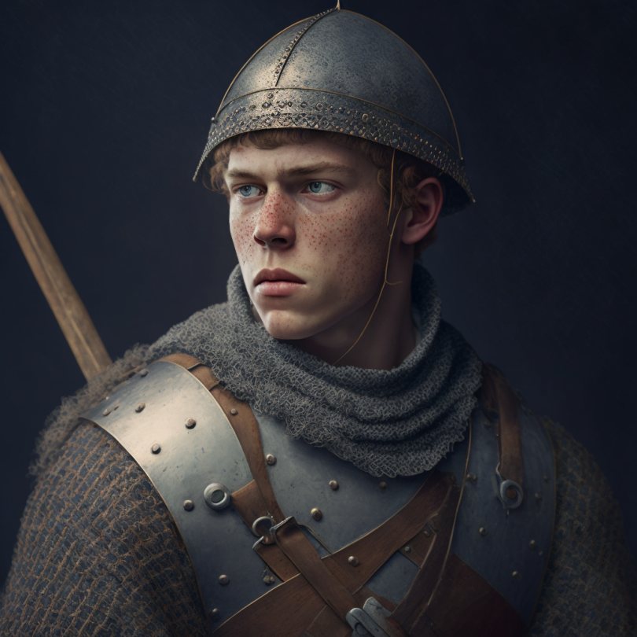

# Odo Cordwaner

- :octicons-info-24:{ .lg .middle } __Biographical Information__

    A [Sembaran](<../../gazetteer/greater-sembara/sembara/sembara.md>) [human](<../../species/children-of-divine-creation/humans/humans.md>) (he/him)  
    Born DR 1700 (49 years old)  
    Sergeant of the [Army Garrison of Cleenseau](<../../groups/sembaran-army/army-garrison-of-cleenseau.md>) (until November 5th, 1719)  
    Guardsman of the [Lord's Guard of Cleenseau](<../../gazetteer/greater-sembara/sembara/barony-of-aveil/cleenseau-region/cleenseau/lord-s-guard-of-cleenseau.md>) (since November 16th, 1719)  
    { .bio }

    Originally from: [Eftly](<../../gazetteer/greater-sembara/sembara/barony-of-aveil/eftly.md>), the [Barony of Aveil](<../../gazetteer/greater-sembara/sembara/barony-of-aveil/barony-of-aveil.md>), [Sembara](<../../gazetteer/greater-sembara/sembara/sembara.md>)
    Based in [Taviose](<../../gazetteer/greater-sembara/sembara/barony-of-aveil/cleenseau-region/taviose.md>), the [Manor of Cleenseau](<../../gazetteer/greater-sembara/sembara/barony-of-aveil/cleenseau-region/manor-of-cleenseau.md>), the [Barony of Aveil](<../../gazetteer/greater-sembara/sembara/barony-of-aveil/barony-of-aveil.md>)

{align="right"; width="320"} Until recently a sergeant of the [Bridge Patrol](<../../groups/sembaran-army/army-garrison-of-cleenseau.md>), he was discharged after failing to heed orders during the [Festival of the Bridge](<../../time/holidays-and-festivals/festival-of-the-bridge.md>). He allowed [François the Bandit](<./francois-the-bandit.md>) access to the food area, despite specific warnings to be on the lookup.

Investigation determined that he was not malicious, but just careless. In the excitement of the festival, he failed to pay attention as he should have. He was discharged from the [Army of the West](<../../groups/sembaran-army/army-of-the-west.md>), but at the intervention of [Robin](<../pcs/cleenseau/robin-of-abenfyrd.md>), was hired by the Essfords to provide a steady presence in [Taviose](<../../gazetteer/greater-sembara/sembara/barony-of-aveil/cleenseau-region/taviose.md>).

He has since developed a romantic attachment to [Abigail Moss](<./abigail-moss.md>), and has come to believe that his mistake was the hand of [The Warlord](<../../cosmology/gods/incorporeal-gods/mos-numena-pantheon/the-warlord.md>), setting him on a path to find his true calling (and setting the [Heroes of Cleenseau](<../pcs/cleenseau/heroes-of-cleenseau.md>) on the path to become heroes).

His family is based in [Eftly](<../../gazetteer/greater-sembara/sembara/barony-of-aveil/eftly.md>), but he left home at 18 to join the army, being the youngest of five children and with no interest in farming.

