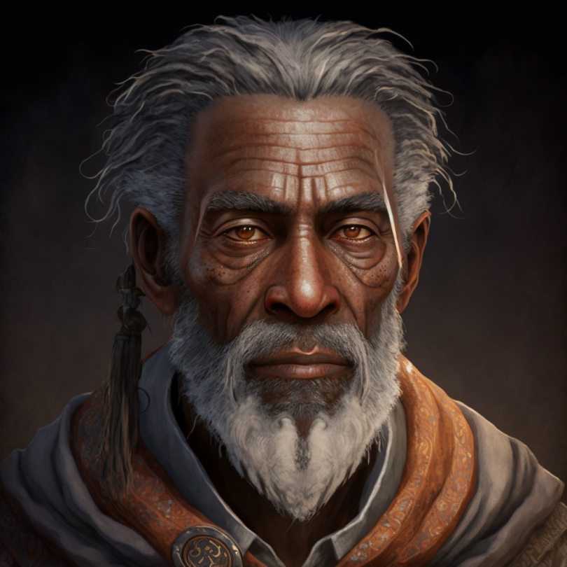

# Perrin Voclain

- :octicons-info-24:{ .lg .middle } __Biographical Information__

    A [Sembaran](<../../gazetteer/greater-sembara/sembara/sembara.md>) [human](<../../species/humans.md>) (he/him)  
    Born DR 1659 (90 years old)  
    { .bio }

    Originally from: Unknown
    Based in [Taviose](<../../gazetteer/greater-sembara/sembara/barony-of-aveil/cleenseau-region/taviose.md>), the [Manor of Cleenseau](<../../gazetteer/greater-sembara/sembara/barony-of-aveil/cleenseau-region/manor-of-cleenseau.md>), the [Barony of Aveil](<../../gazetteer/greater-sembara/sembara/barony-of-aveil/barony-of-aveil.md>)

{align="right"; width="320"}Perrin Voclain is a sage and acolyte of the Wildling who lives in [Taviose](<../../gazetteer/greater-sembara/sembara/barony-of-aveil/cleenseau-region/taviose.md>). He is known for his friendship with the animals of [the Wood](<../../gazetteer/greater-sembara/sembara/barony-of-aveil/cleenseau-region/cleenseau-wood.md>), and for his minor miracles of healing and guidance. 

