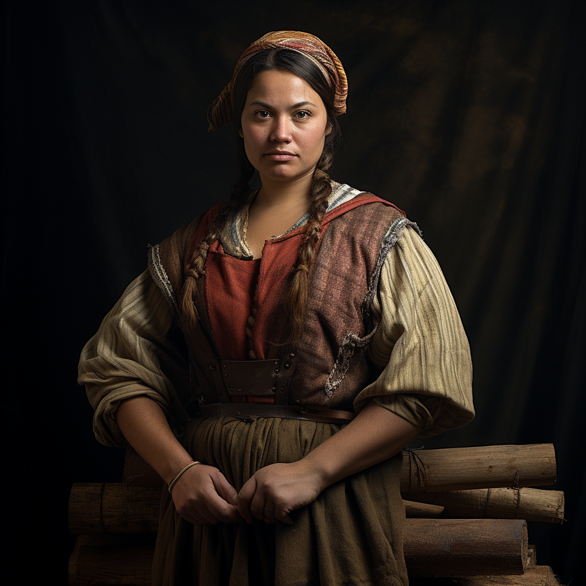

# Phillipa Northwood

- :octicons-info-24:{ .lg .middle } __Biographical Information__

    A [Sembaran](<../../gazetteer/greater-sembara/sembara/sembara.md>) [human](<../../species/children-of-divine-creation/humans/humans.md>) (she/her)  
    Born DR 1679 (70 years old)  
    { .bio }

    Based in [Taviose](<../../gazetteer/greater-sembara/sembara/barony-of-aveil/cleenseau-region/taviose.md>), the [Manor of Cleenseau](<../../gazetteer/greater-sembara/sembara/barony-of-aveil/cleenseau-region/manor-of-cleenseau.md>), the [Barony of Aveil](<../../gazetteer/greater-sembara/sembara/barony-of-aveil/barony-of-aveil.md>)

{align="right"; width="320"}The lynchpin of the Northwood family, she is a woodcutter and friend of [Perrin Voclain](<./perrin-voclain.md>). She came along with [Odo Cordwaner](<./odo-cordwaner.md>) and [Hugh Darrow](<./hugh-darrow.md>) to help the [Heroes of Cleenseau](<../pcs/cleenseau/heroes-of-cleenseau.md>) during the [Battle Against Wakog](<../../events/1700s/1719/12/battle-against-wakog.md>) and is strong and knows how to swing an axe. She has been very helpful assisting [Catherine de Brune](<./catherine-de-brune.md>) at extracting spider silk from the [Cleenseau Wood](<../../gazetteer/greater-sembara/sembara/barony-of-aveil/cleenseau-region/cleenseau-wood.md>).

She lives with her wife and their two teenage children and her older brother, who was widowed by the [Second Spider Attack on Tavoise](<../../events/1700s/1719/10/second-spider-attack-on-tavoise.md>). Her niece and her niece's husband live next door. Her oldest child and her son-in-law died in the spider attacks. 