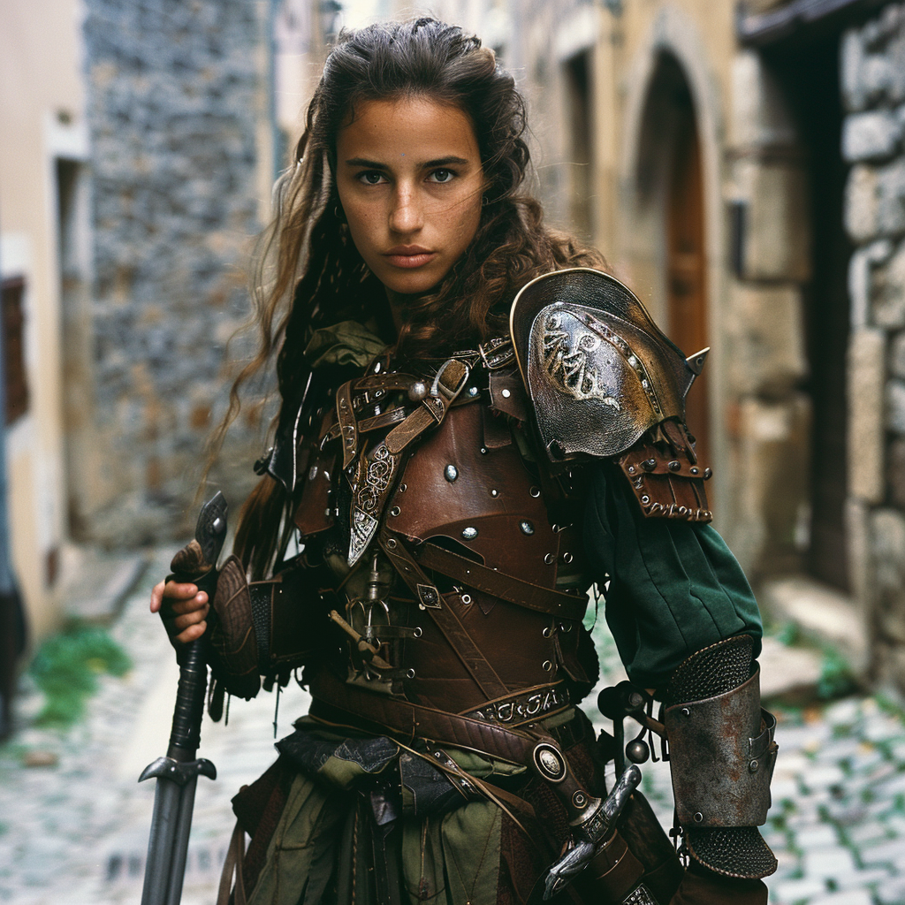

# Remille Vauclaire
:speaker:{ .middle } *(Ruh-mee Voh-klair)*  

- :octicons-info-24:{ .lg .middle } __Biographical Information__

    A [human](<../../species/humans.md>) (she/her)  
    Member of [The Rangers](<../../groups/the-rangers.md>)  
    { .bio }

    Based in [Adderfell](<../../gazetteer/greater-sembara/addermarch/adderfell.md>), [Addermarch](<../../gazetteer/greater-sembara/addermarch/addermarch.md>)

:octicons-location-24:{ .lg .middle } Currently in the [Barony of Aveil](<../../gazetteer/greater-sembara/sembara/barony-of-aveil/barony-of-aveil.md>), [Sembara](<../../gazetteer/greater-sembara/sembara/sembara.md>)

{align="right"; width="400"}A swordswoman. 

