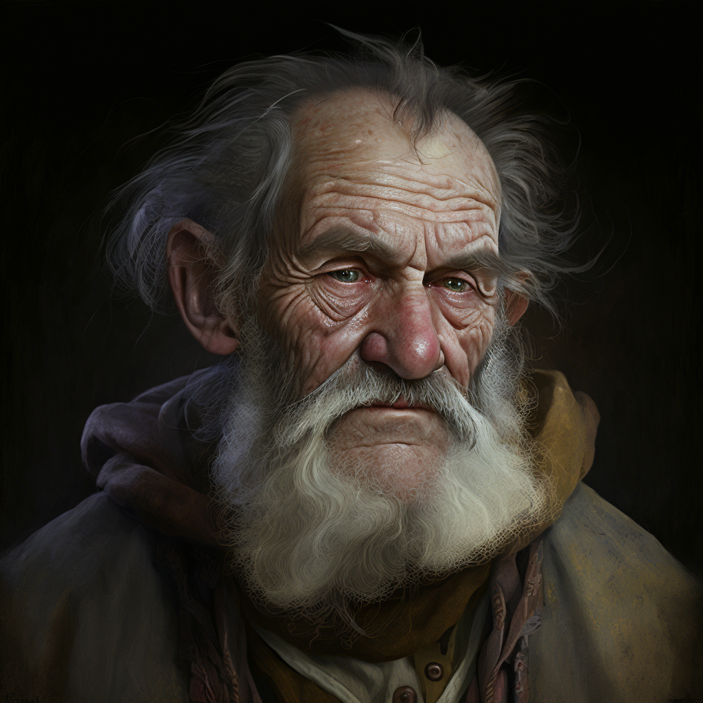

# Grandpa Remy Darrow

- :octicons-info-24:{ .lg .middle } __Biographical Information__

    A [Sembaran](<../../gazetteer/greater-sembara/sembara/sembara.md>) [human](<../../species/humans.md>) (he/him)  
    Born DR 1640 (109 years old)  
    { .bio }

    Based in [Taviose](<../../gazetteer/greater-sembara/sembara/barony-of-aveil/cleenseau-region/taviose.md>), the [Manor of Cleenseau](<../../gazetteer/greater-sembara/sembara/barony-of-aveil/cleenseau-region/manor-of-cleenseau.md>), the [Barony of Aveil](<../../gazetteer/greater-sembara/sembara/barony-of-aveil/barony-of-aveil.md>)

{align="right"; width="320"}Grandpa Remy is well-liked for his off-color jokes and his fondness for apple brandy. He was saved from death by [Izgil's](<../pcs/cleenseau/izgil-moonseeker.md>) magic and has become one of the biggest boosters of the [Heroes of Cleenseau](<../pcs/cleenseau/heroes-of-cleenseau.md>). 

He is the patriarch of the Darrow family, who are well known for charcoal making. His granddaughter [Nicole Darrow](<./nicole-darrow.md>) died in the [Cleenseau Spider Attacks](<../../events/1700s/1719/10/cleenseau-spider-attacks.md>). His the father of [Hugh Darrow](<./hugh-darrow.md>).