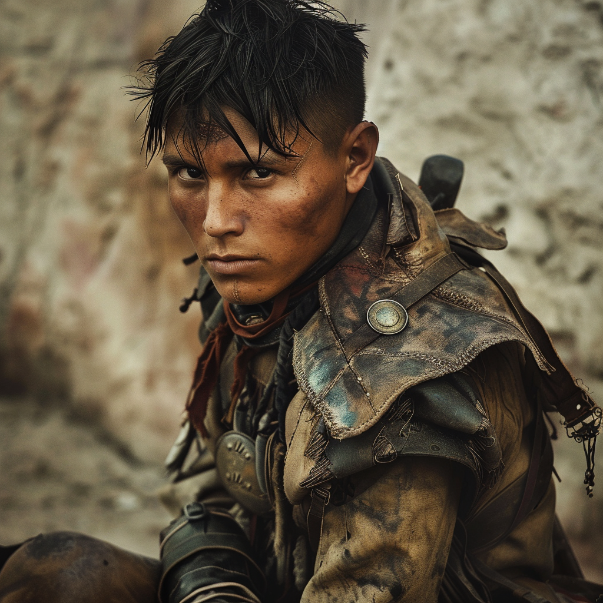

# Rene Dubois

- :octicons-info-24:{ .lg .middle } __Biographical Information__

    A [Sembaran](<../../gazetteer/greater-sembara/sembara/sembara.md>) [human](<../../species/humans/humans.md>) (he/him)  
    { .bio }

    Originally from: the [Barony of Brumecliff](<../../gazetteer/greater-sembara/sembara/borderlands/barony-of-brumecliff.md>), [Sembara](<../../gazetteer/greater-sembara/sembara/sembara.md>)
    Based with the [Army of the South](<../../groups/sembaran-army/army-of-the-south.md>), in [Fellburn](<../../gazetteer/greater-sembara/sembara/heartlands/fellburn.md>), the [Duchy of Wisford](<../../gazetteer/greater-sembara/sembara/heartlands/duchy-of-wisford.md>)

{align="right"; width="320"}A scout and skirmisher with the Eagle Patrol of the Ninth Company of the [Army of the South](<../../groups/sembaran-army/army-of-the-south.md>), skilled at spotting unusual events.