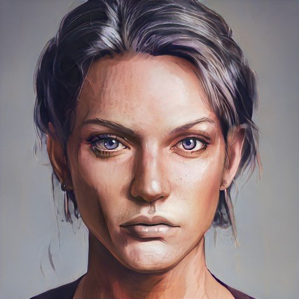

# Lady Rosalind Essford
>[!info]+ Biographical Info
> A [Sembaran](<../../gazetteer/greater-sembara/sembara/sembara.md>) [human](<../../species/humans/humans.md>) (she/her)
> 
> 
>> 
>> 

The daughter of [Wymar](<./wymar-essford.md>), short, and with hair just beginning to grey, but forceful out of propotion to her size, and with a sharp intelligence to her eyes. Popular with the townspeople and said to be wise and fair. She married [Arthur Bybet](<./arthur-bybet.md>) in 1706, and their match has been a good and popular one. 

In the late fall of 1719, she lost her three children and their nursemaid to a [unseasonable flood of the Enst](<../../events/1700s/1719/10/tragic-flood-of-the-river-enst.md>). 
She enjoys quite music, especially [Robin's](<../pcs/cleenseau/robin-of-abenfyrd.md>) playing, which has been a comfort to her since her children died. 

