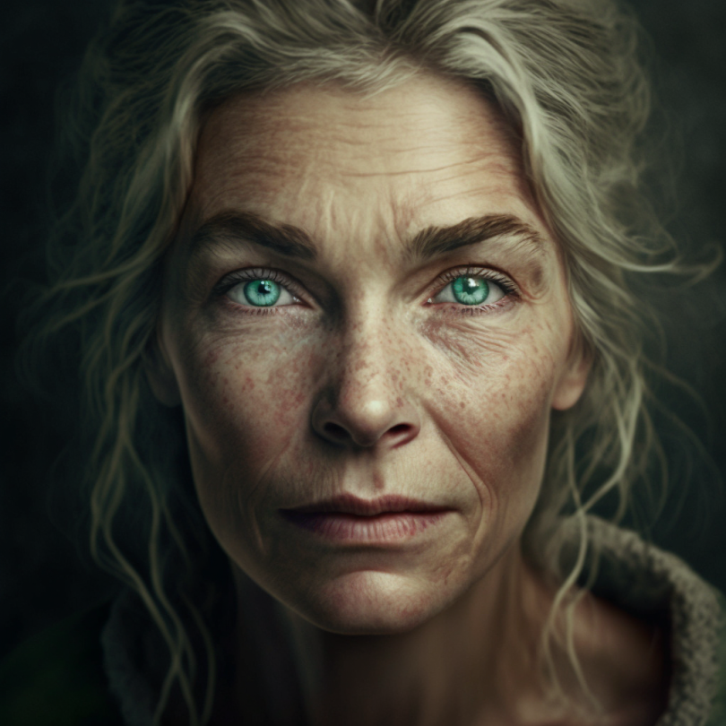

# Sabine de Brune

- :octicons-info-24:{ .lg .middle } __Biographical Information__

    A [Sembaran](<../../gazetteer/greater-sembara/sembara/sembara.md>) [human](<../../species/children-of-divine-creation/humans/humans.md>) (she/her), of the de Brunes  
    Born DR 1662 (87 years old)  
    Castellan of [Valit](<../../gazetteer/greater-sembara/sembara/barony-of-aveil/cleenseau-region/valit.md>)  
    { .bio }

    Based in [Valit](<../../gazetteer/greater-sembara/sembara/barony-of-aveil/cleenseau-region/valit.md>), the [Manor of Valit](<../../gazetteer/greater-sembara/sembara/barony-of-aveil/cleenseau-region/manor-of-valit.md>), the [Barony of Aveil](<../../gazetteer/greater-sembara/sembara/barony-of-aveil/barony-of-aveil.md>)

{align="right"; width="320"}The aging castellan of [Valit](<../../gazetteer/greater-sembara/sembara/barony-of-aveil/cleenseau-region/valit.md>), a vassal of the Baron of Aveil. Organized about managing the manor, but with a soft spot for bardic tales and romance. Never married, although is rumored to have had several great loves in her youth. She is also the magistrate for the village of Valit.

The de Brune family has long roots in the Enst river valley, and although [Eskbridge](<../../gazetteer/greater-sembara/sembara/heartlands/eskbridge.md>) is their primary area of operations, there are several outposts along the Enst including a longstanding one in the Cleenseau region. Recently, the family under [Catherine de Brune](<./catherine-de-brune.md>) has grown to include some more diverse mercantile interests in this region.

She was appointed as the castellan by [Reginald Rusebek](<./reginald-rusebek.md>) and still feels disgust and guilt that she was such a loyal supporter of his. She doesn't like to talk about baronial affairs much, and focuses on the village and doing her duties diligently. 