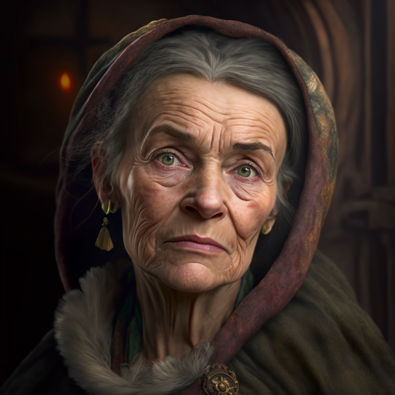

# Selma Wisthelwind

- :octicons-info-24:{ .lg .middle } __Biographical Information__

    A Highlander [human](<../../species/humans/humans.md>) (she/her)  
    Born DR 1644 (105 years old)  
    Proprietor of [The Fox’s Flagon](<../../gazetteer/greater-sembara/sembara/barony-of-aveil/cleenseau-region/cleenseau/the-fox-s-flagon.md>) (since DR 1712)  
    { .bio }

    Originally from: [Ardlas](<../../gazetteer/greater-sembara/zimkova/ardlas.md>)
    Based in [The Fox’s Flagon](<../../gazetteer/greater-sembara/sembara/barony-of-aveil/cleenseau-region/cleenseau/the-fox-s-flagon.md>), [Cleenseau](<../../gazetteer/greater-sembara/sembara/barony-of-aveil/cleenseau-region/cleenseau/cleenseau.md>), the [Manor of Cleenseau](<../../gazetteer/greater-sembara/sembara/barony-of-aveil/cleenseau-region/manor-of-cleenseau.md>)

