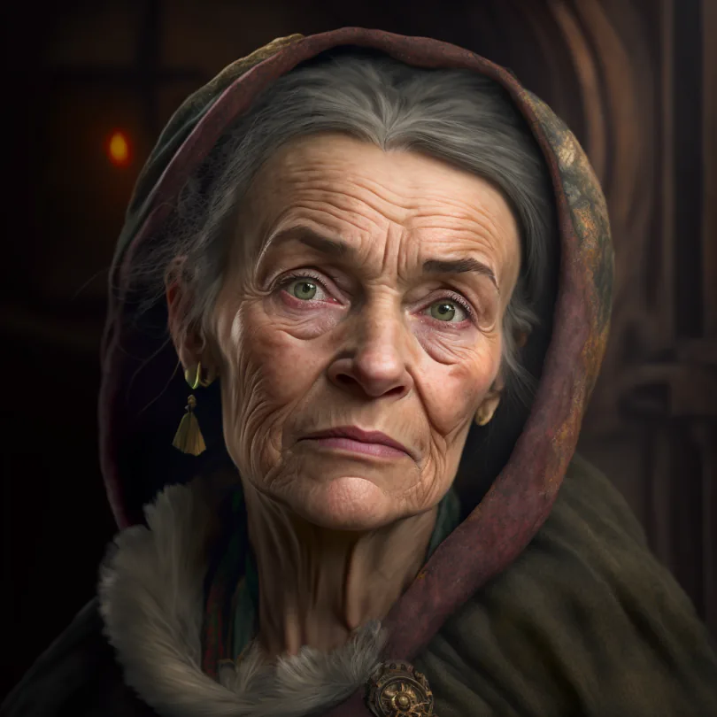

# Selma Wisthelwind

- :octicons-info-24:{ .lg .middle } __Biographical Information__

    A [Zimka](<../../groups/cultures/zimka.md>) [human](<../../creatures/species/humans.md>) (she/her)  
    Born DR 1644 (106 years old)  
    Proprietor of [The Fox’s Flagon](<../../gazetteer/greater-sembara/sembara/barony-of-aveil/cleenseau-region/cleenseau/the-fox-s-flagon.md>) (since DR 1712)  
    { .bio }

    Originally from: [Ardlas](<../../gazetteer/greater-sembara/ardlas.md>)
    Based in [The Fox’s Flagon](<../../gazetteer/greater-sembara/sembara/barony-of-aveil/cleenseau-region/cleenseau/the-fox-s-flagon.md>), [Cleenseau](<../../gazetteer/greater-sembara/sembara/barony-of-aveil/cleenseau-region/cleenseau/cleenseau.md>), the [Manor of Cleenseau](<../../gazetteer/greater-sembara/sembara/barony-of-aveil/cleenseau-region/manor-of-cleenseau.md>)

{align="right"; width="320"}Selma bought The Fox's Flagon for cash 8 years ago, and seems to enjoy running the inn as a retirement of sorts. From what exactly is not clear. She has always been a bit of an outsider in town and is one of the few people who keeps the old [Kestavo](<../../gods-and-religions/religions/northern-folk-religions/kestavo.md>) religion of [Zimkova](<../../gazetteer/greater-sembara/zimkova/zimkova.md>).