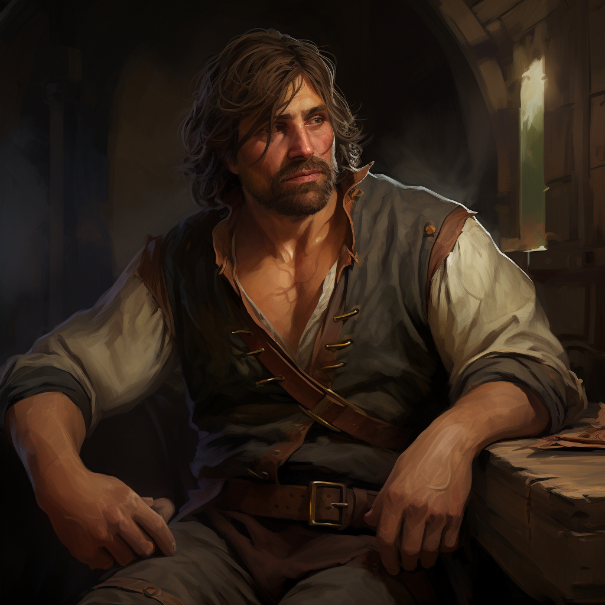

# Thierry
:speaker:{ .middle } *(Tee-eh-ree)*  

- :octicons-info-24:{ .lg .middle } __Biographical Information__

    A [Sembaran](<../../gazetteer/greater-sembara/sembara/sembara.md>) [human](<../../species/children-of-divine-creation/humans/humans.md>) (he/him)  
    Born DR 1684 (65 years old)  
    { .bio }

    Based in [Asineau](<../../gazetteer/greater-sembara/sembara/barony-of-aveil/cleenseau-region/asineau.md>), the [Manor of Asineau](<../../gazetteer/greater-sembara/sembara/barony-of-aveil/cleenseau-region/manor-of-asineau.md>), the [Barony of Aveil](<../../gazetteer/greater-sembara/sembara/barony-of-aveil/barony-of-aveil.md>)

{align="right"; width="320"}A local boatbuilder in [Asineau](<../../gazetteer/greater-sembara/sembara/barony-of-aveil/cleenseau-region/asineau.md>), he served in the [Army of the West](<../../groups/sembaran-army/army-of-the-west.md>) in his younger days. 