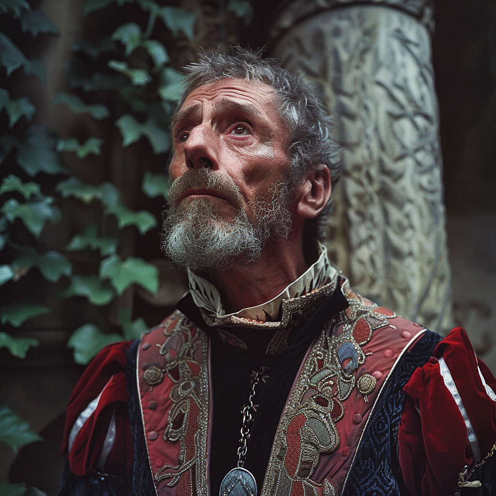

# Thomas Dyerson

- :octicons-info-24:{ .lg .middle } __Biographical Information__

    A [Sembaran](<../../gazetteer/greater-sembara/sembara/sembara.md>) [human](<../../species/children-of-divine-creation/humans/humans.md>) (he/him)  
    Magistrate of the [Barony of Aveil](<../../gazetteer/greater-sembara/sembara/barony-of-aveil/barony-of-aveil.md>)  
    { .bio }

    Based in [Veltor](<../../gazetteer/greater-sembara/sembara/barony-of-aveil/veltor.md>), the [Barony of Aveil](<../../gazetteer/greater-sembara/sembara/barony-of-aveil/barony-of-aveil.md>), [Sembara](<../../gazetteer/greater-sembara/sembara/sembara.md>)

{align="right"; width="200"}One of three assistants to [Victorine Rosseau](<./victorine-rosseau.md>), Thomas is an important magistrate in the [Barony of Aveil](<../../gazetteer/greater-sembara/sembara/barony-of-aveil/barony-of-aveil.md>) and often travels to investigate and adjudicate crimes on behalf of the Barony. He is dedicated to his job, if a bit uncreative, and willing to look beyond the obvious when pushed.