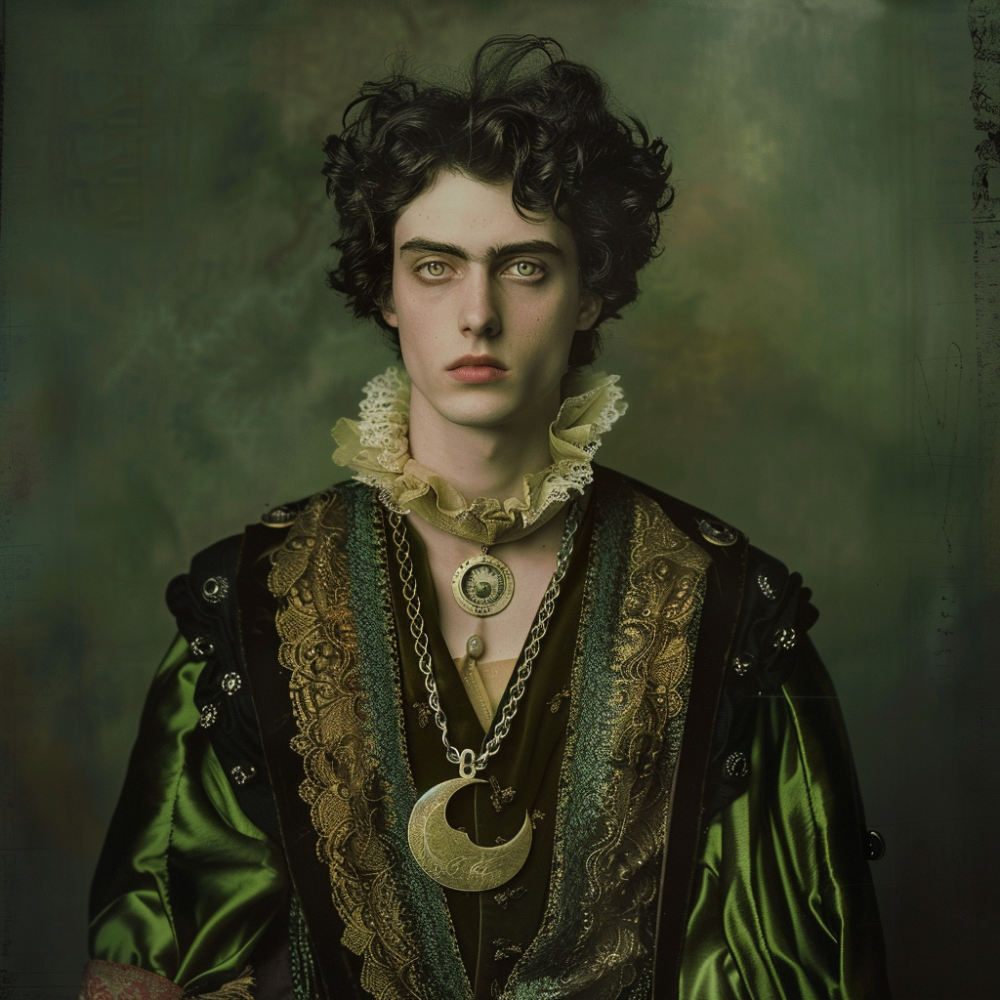

# Tristan Vaudrillard
:speaker:{ .middle } *(Tris-tan Voh-dree-yar)*  

- :octicons-info-24:{ .lg .middle } __Biographical Information__

    A [Sembaran](<../../gazetteer/greater-sembara/sembara/sembara.md>) [human](<../../species/children-of-divine-creation/humans/humans.md>) (he/him)  
    Born DR 1698 (51 years old)  
    Member of [The Rangers](<../../groups/the-rangers.md>)  
    { .bio }

    Originally from: [Tafolwern](<../../gazetteer/greater-sembara/tyrwingha/tafolwern.md>), [Tyrwingha](<../../gazetteer/greater-sembara/tyrwingha/tyrwingha.md>)

:octicons-location-24:{ .lg .middle } Last known location (as of January 14th, 1720): [Eftly](<../../gazetteer/greater-sembara/sembara/barony-of-aveil/eftly.md>), the [Barony of Aveil](<../../gazetteer/greater-sembara/sembara/barony-of-aveil/barony-of-aveil.md>), [Sembara](<../../gazetteer/greater-sembara/sembara/sembara.md>)

{align="right"; width="400"}A devotee of [The Sibyl](<../../cosmology/gods/incorporeal-gods/mos-numena-pantheon/the-sibyl.md>) and student of magic.

