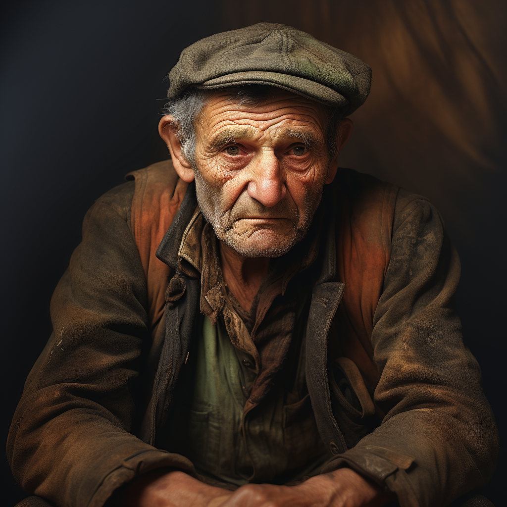

# Walter of Cleenseau

- :octicons-info-24:{ .lg .middle } __Biographical Information__

    A [Sembaran](<../../gazetteer/greater-sembara/sembara/sembara.md>) [human](<../../species/humans.md>) (he/him)  
    Born DR 1636 (113 years old)  
    { .bio }

    Based in [Cleenseau](<../../gazetteer/greater-sembara/sembara/barony-of-aveil/cleenseau-region/cleenseau/cleenseau.md>), the [Manor of Cleenseau](<../../gazetteer/greater-sembara/sembara/barony-of-aveil/cleenseau-region/manor-of-cleenseau.md>), the [Barony of Aveil](<../../gazetteer/greater-sembara/sembara/barony-of-aveil/barony-of-aveil.md>)

{align="right"; width="320"}An older man, who used to work at the [Army Garrison of Cleenseau](<../../groups/sembaran-army/army-garrison-of-cleenseau.md>) helping maintain the barracks and other similar clerking activities. Now retired, although he still lives at the garrison and acts as a sort-of unofficial cleaner.

He is very fond of [Emmeline Duval's](<./emmeline-duval.md>) baking.