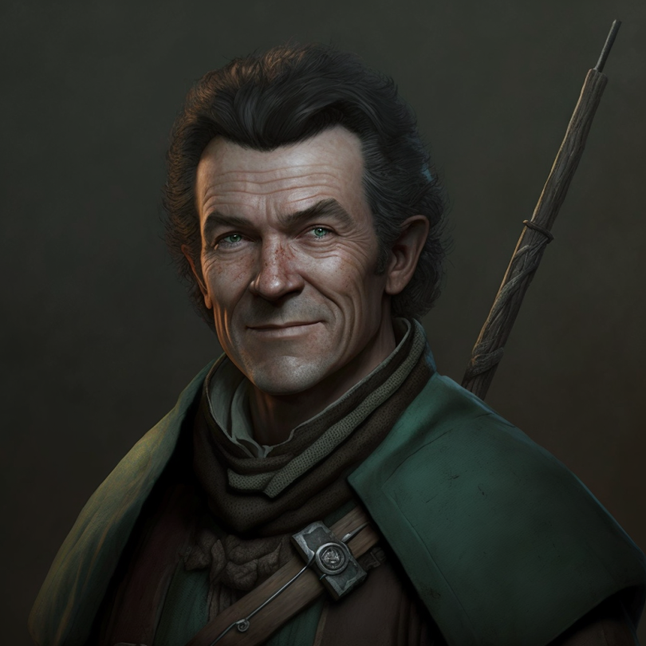

# Warin the Woodsman
>[!info]+ Biographical Info
> A [Sembaran](<../../gazetteer/greater-sembara/sembara/sembara.md>) [human](<../../species/humans/humans.md>) (he/him)
> 
>> 

A tracker and woodsman from [Valit](<../../gazetteer/greater-sembara/sembara/barony-of-aveil/cleenseau-region/valit.md>), and confidant of [Sabine de Brune](<./sabine-de-brune.md>).

