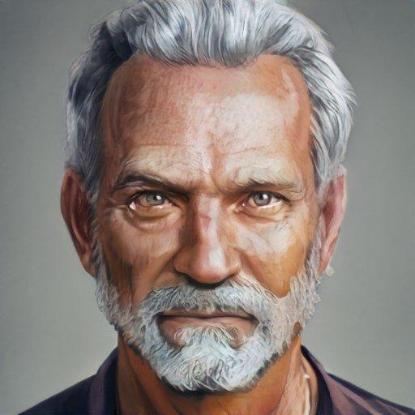

# Lord Wymar Essford
>[!info]+ Biographical Info
> A [Sembaran](<../../gazetteer/greater-sembara/sembara/sembara.md>) [human](<../../species/humans/humans.md>) (he/him), of Essords
> 
> 
>> 
>> 

The aging and senile lord of the manor in [Cleenseau](<../../gazetteer/greater-sembara/sembara/barony-of-aveil/cleenseau-region/cleenseau/cleenseau.md>). The son of [Reginald Essford](<../historical-figures/reginald-essford.md>) and [Celine Essford](<../historical-figures/celine-essford.md>). He is rarely involved in the day to day events of the town. His children are [Rosalind Essford](<./rosalind-essford.md>) and [Rinault Essford](<./rinault-essford.md>). Since March 1719, he has been suffering from increasingly significant dementia and his daughter has largely taken over the management of [Cleenseau](<../../gazetteer/greater-sembara/sembara/barony-of-aveil/cleenseau-region/cleenseau/cleenseau.md>). 

{width="320"}

>[!info] Childhood Story, as told to [Viepuck](<../pcs/cleenseau/viepuck.md>) under the influence of his patron's mind-probe
In his childhood, he recalled overhearing his parents (Reginald and Celine). Reginald was very drunk, and was weeping. Wymar recalls hearing his father sobbing to Celine: "I can't forget it. That day, the bodies just kept walking up out of the tower, just below us, and he was grinning even as we struck him down. Mother help me, I want to forget. Sometimes in my dreams I still see it. Was it wrong to build here? Is this place cursed?".

