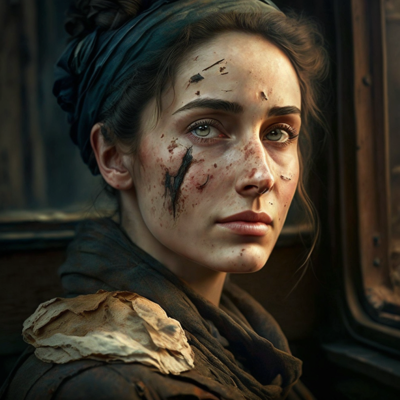

# Ysabel

- :octicons-info-24:{ .lg .middle } __Biographical Information__

    A [Sembaran](<../../gazetteer/greater-sembara/sembara/sembara.md>) [human](<../../species/humans/humans.md>) (she/her)  
    b. DR 1688 - d. January 6th, 1720, died at age 32 years  
    Sheriff of the [Lord's Guard of Cleenseau](<../../gazetteer/greater-sembara/sembara/barony-of-aveil/cleenseau-region/cleenseau/lord-s-guard-of-cleenseau.md>) (until January 6th, 1720)  
    { .bio }

    Lived in [Cleenseau](<../../gazetteer/greater-sembara/sembara/barony-of-aveil/cleenseau-region/cleenseau/cleenseau.md>), the [Manor of Cleenseau](<../../gazetteer/greater-sembara/sembara/barony-of-aveil/cleenseau-region/manor-of-cleenseau.md>), the [Barony of Aveil](<../../gazetteer/greater-sembara/sembara/barony-of-aveil/barony-of-aveil.md>)

{align="right"; width="420"} A striking and comely woman with a rough scar running from her eye to her neck. She is the sheriff of [Cleenseau](<../../gazetteer/greater-sembara/sembara/barony-of-aveil/cleenseau-region/cleenseau/cleenseau.md>) and leads a part of the [Lord's Guard](<../../gazetteer/greater-sembara/sembara/barony-of-aveil/cleenseau-region/cleenseau/lord-s-guard-of-cleenseau.md>). She has many opinions about her employers, in particular [Rinault Essford](<./rinault-essford.md>), and does not always successfully keep them to herself.

