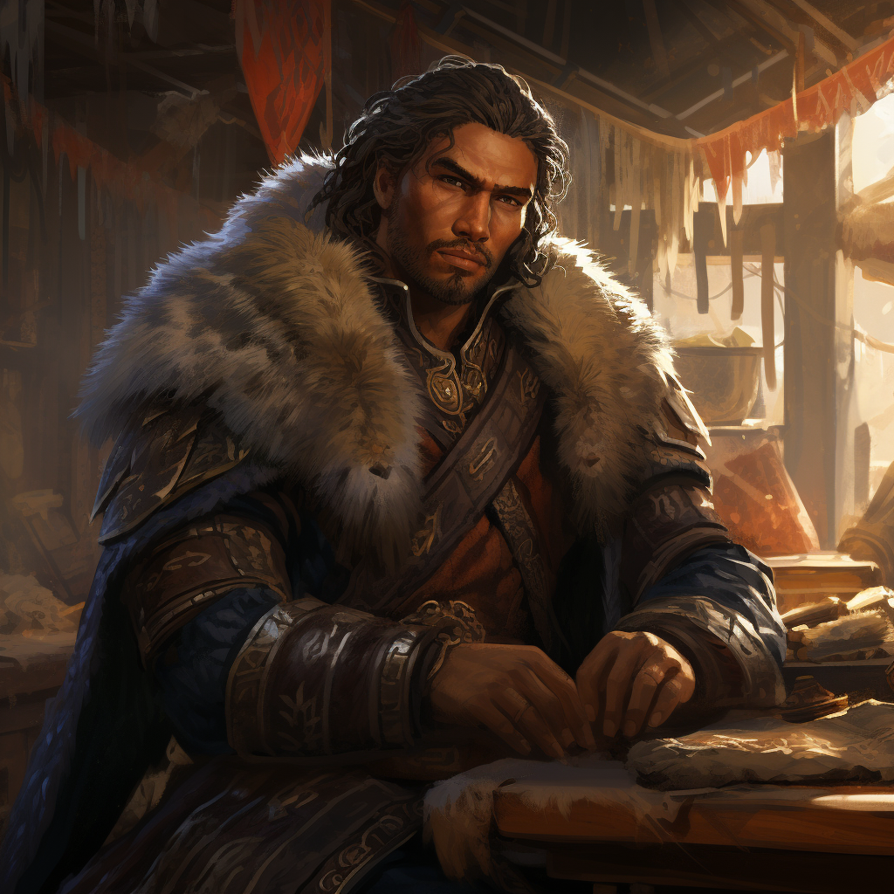

# Kaupa

- :octicons-info-24:{ .lg .middle } __Biographical Information__

    A [Skaer](<../../gazetteer/western-green-sea/skaerhem/skaerhem.md>) [human](<../../species/children-of-divine-creation/humans/humans.md>) (he/him)  
    Born DR 1710 (39 years old)  
    { .bio }

    Originally from: [Skaerhem](<../../gazetteer/western-green-sea/skaerhem/skaerhem.md>)
    Based in the [Free City of Tollen](<../../gazetteer/western-green-sea/tollen/tollen.md>)

:octicons-location-24:{ .lg .middle } Met by the [Dunmar Fellowship](<../pcs/dunmar-fellowship/dunmar-fellowship.md>) on December 30th, 1748 in the [Free City of Tollen](<../../gazetteer/western-green-sea/tollen/tollen.md>)  

{align="right"; width="420"}A diligent representative of the Skaer Trade Mission, Kaupa's role in [Tollen](<../../gazetteer/western-green-sea/tollen/tollen.md>) is vital in ensuring that trade relations between [Skaerhem](<../../gazetteer/western-green-sea/skaerhem/skaerhem.md>) and [Tollen](<../../gazetteer/western-green-sea/tollen/tollen.md>) remain strong and beneficial for both parties.

Kaupa serves as the informal center of the small Skaer community in Tollen, and generally knows, or at least knows someone who knows, all the Skaer who make Tollen their home. 

He is protective of the local Skaer and sees his role, in part, as the person who ensures that the local Skaer community thrives. 