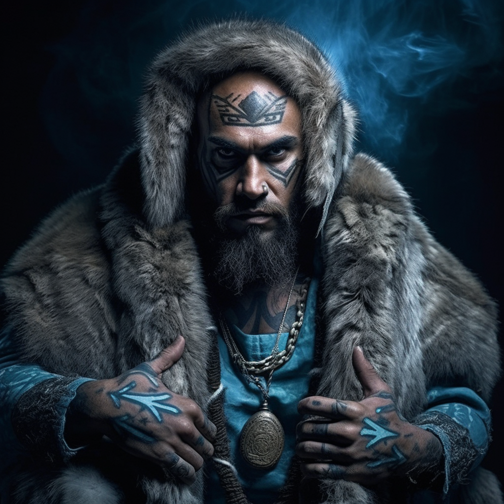

# Hakeasa Vaallinen
:speaker:{ .middle } *(va-lin-en)*  

- :octicons-info-24:{ .lg .middle } __Biographical Information__

    A [Skaer](<../../gazetteer/western-green-sea/realms/skaer.md>) [human](<../../species/humans.md>) (he/him)  
    Born DR 1713 (36 years old)  
    { .bio }

    Based in [Pyhlla](<../../gazetteer/western-green-sea/skaerhem/pyhlla.md>), [Skaerhem](<../../gazetteer/western-green-sea/skaerhem/skaerhem.md>)

:octicons-location-24:{ .lg .middle } Met by the [Dunmar Fellowship](<../pcs/dunmar-fellowship/dunmar-fellowship.md>) on December 25th, 1748 in [Pyhlla](<../../gazetteer/western-green-sea/skaerhem/pyhlla.md>), [Skaerhem](<../../gazetteer/western-green-sea/skaerhem/skaerhem.md>)  

Vaallinen (va-lin-en), a Skaer man with the traditional blue facial tattoos of Skaer priests, is the hakeasa (speaker to the gods) for [Pyhlla](<../../gazetteer/western-green-sea/skaerhem/pyhlla.md>). Born and raised in the region, he is locally known for his connection to the divine. 

