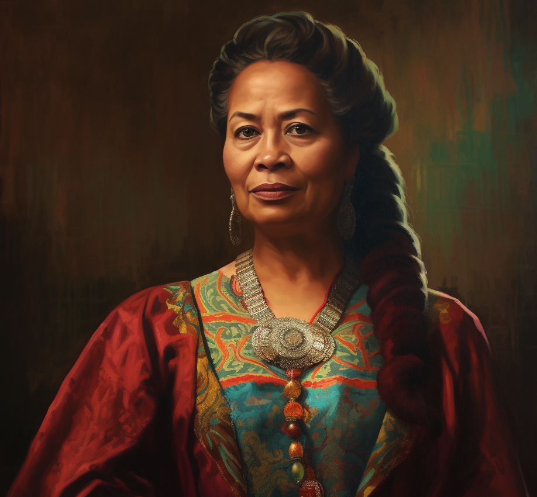

# Cecilia Lister

- :octicons-info-24:{ .lg .middle } __Biographical Information__

    A Tollender [human](<../../species/humans/humans.md>) (she/her)  
    Born DR 1694 (55 years old)  
    Member of the Dyer's Guild  
    { .bio }

    Based in the Free City of Tollen

:octicons-location-24:{ .lg .middle } Met by the [Dunmar Fellowship](<../pcs/dunmar-fellowship/dunmar-fellowship.md>) on December 30th, 1748 in the Free City of Tollen  

An elegant older woman, very precise, who runs an unmarked but well-known tattoo parlor in Southbridge in Tollen. Important in the Dyer's Guild, and rich. Extremely skilled in the arts of tattoos, especially magical tattoos made with enchanted dyes.

