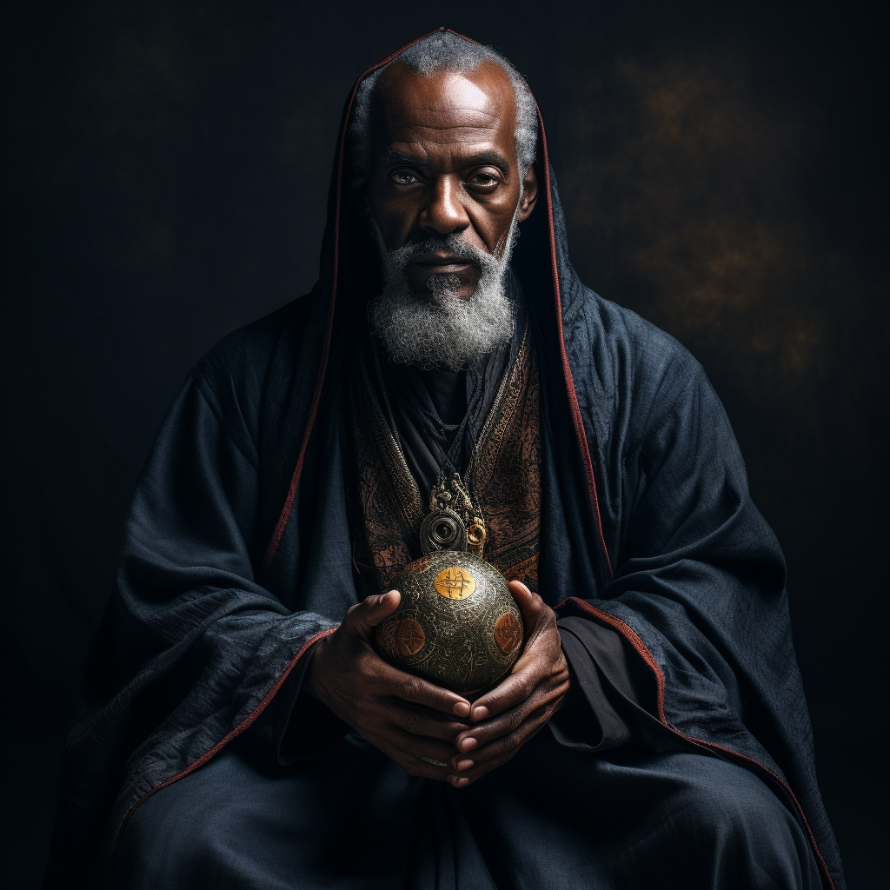

# Godfrey of Marburgh

- :octicons-info-24:{ .lg .middle } __Biographical Information__

    A [Sembaran](<../../gazetteer/greater-sembara/sembara/sembara.md>) [human](<../../species/humans.md>) (he/him)  
    Born DR 1688 (61 years old)  
    { .bio }

    Originally from: Marburgh
    Based in the [Free City of Tollen](<../../gazetteer/greater-sembara/tollen/tollen.md>)

{align="right"; width="400"}Godfrey is an Elder of [The Sibyl](<../../gods-and-religions/gods/incorporeal-gods/mos-numena-pantheon/the-sibyl.md>), strongly blessed and capable of channeling powerful miracles. He is associated with the large Temple of the Sibyl in Tollen. He is a serious, deeply religious man, knowledgable both in the lore of magic and the rituals and miracles of the Sibyl. 

Godfrey grew up in a small village in [Sembara](<../../gazetteer/greater-sembara/sembara/sembara.md>). In his teenage years, it became obvious that he had a powerful and unusual connection to [The Sibyl](<../../gods-and-religions/gods/incorporeal-gods/mos-numena-pantheon/the-sibyl.md>). He traveled to [Embry](<../../gazetteer/greater-sembara/sembara/heartlands/embry.md>), and then later to [Tollen](<../../gazetteer/greater-sembara/tollen/tollen.md>), where he stayed. 

