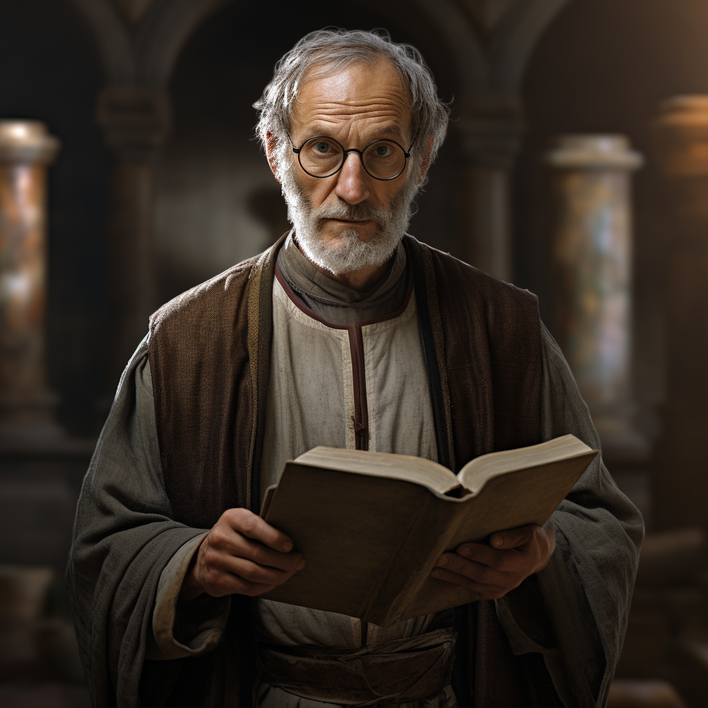

# Hugo Dupont

- :octicons-info-24:{ .lg .middle } __Biographical Information__

    An Isinguer [human](<../../species/humans/humans.md>) (he/him)  
    Born DR 1691 (58 years old)  
    Member of the University of Tollen  
    { .bio }

    Based in the Free City of Tollen

:octicons-location-24:{ .lg .middle } Met by the [Dunmar Fellowship](<../pcs/dunmar-fellowship/dunmar-fellowship.md>) on December 29th, 1748 in Magnus Street, the Free City of Tollen  

{align="right"; width="320"}Hugo Dupont is scholar and theologian, and a lecturer at the university, known for his classes on comparative divinity and theological science, particularly a series of lectures and scholastic discourse on the nature of intercessionary prayer, and the intertwined divinities of the [Eight Divines](<../../cosmology/religions/mos-numena.md>). 

He is well-known in the Isinguese community, and also well connected across the non-human community, including with [Caelynn](<../fey/caelynn.md>). 