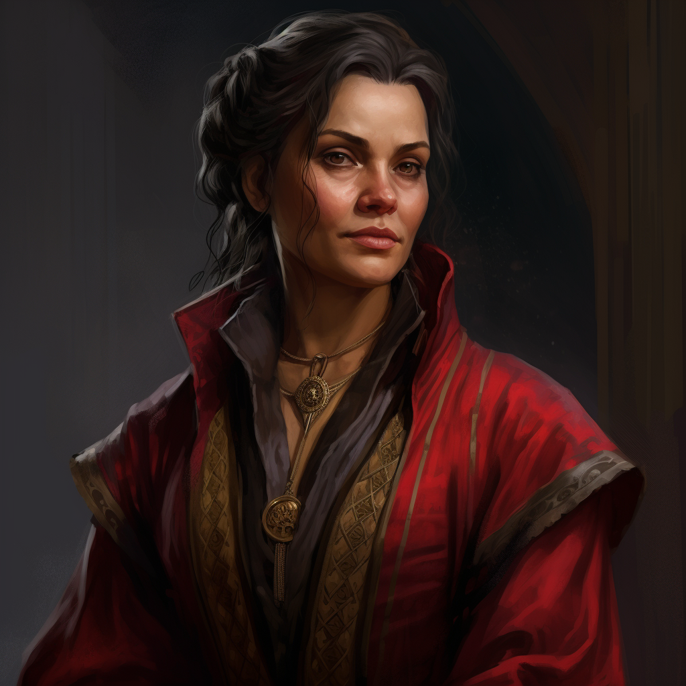

# Captain Jane Chapman

- :octicons-info-24:{ .lg .middle } __Biographical Information__

    A [Tollender](<../../gazetteer/western-green-sea/tollen/tollen.md>) [human](<../../species/humans/humans.md>) (she/her), of the the Chapmans  
    Born DR 1715 (34 years old)  
    Member of the [Dyer's Guild](<../../groups/tollen-guilds/dyer-s-guild.md>)  
    { .bio }

    Based in the [Free City of Tollen](<../../gazetteer/western-green-sea/tollen/tollen.md>)

:octicons-location-24:{ .lg .middle } Met by the [Dunmar Fellowship](<../pcs/dunmar-fellowship/dunmar-fellowship.md>) on December 30th, 1748 in the [Dyer's Guildhall](<../../gazetteer/western-green-sea/tollen/dyer-s-guildhall.md>), the [Free City of Tollen](<../../gazetteer/western-green-sea/tollen/tollen.md>)  

A Tollender-born woman in her early 30s, from the well-off and well-established Chapman merchant family, Jane became a Dyer's Guild captain known for her skill and her luck at sea.  

{align="right"; width="320"}

