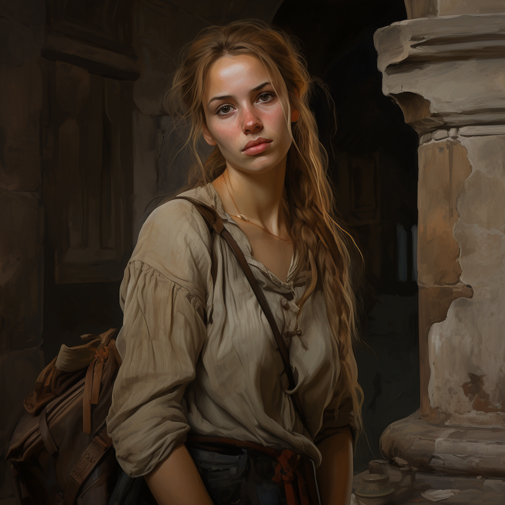

# Nika Hyne

- :octicons-info-24:{ .lg .middle } __Biographical Information__

    A [Tollender](<../../gazetteer/greater-sembara/tollen/tollen.md>) [human](<../../species/humans.md>) (she/her)  
    Born DR 1728 (21 years old)  
    { .bio }

    Based in [Fiskurth](<../../gazetteer/greater-sembara/tollen/fiskurth.md>), the [Free City of Tollen](<../../gazetteer/greater-sembara/tollen/tollen.md>), the Western Green Sea Region

:octicons-location-24:{ .lg .middle } Met by the [Dunmar Fellowship](<../pcs/dunmar-fellowship/dunmar-fellowship.md>) on December 17th, 1748 in [The Windward Sail](<../../gazetteer/greater-sembara/tollen/the-windward-sail.md>), [Fiskurth](<../../gazetteer/greater-sembara/tollen/fiskurth.md>), the [Free City of Tollen](<../../gazetteer/greater-sembara/tollen/tollen.md>)  

{align="right"; width="320"}Nika Hyne is a sly young woman in her early twenties known to frequent [The Windward Sail](<../../gazetteer/greater-sembara/tollen/the-windward-sail.md>), listening to stories and doing odd jobs for coin. She was briefly a student at the [University of Tollen](<../../gazetteer/greater-sembara/tollen/university-of-tollen.md>): although she dropped out, she knows the area and the people well. She is a bit of a hustler. 

