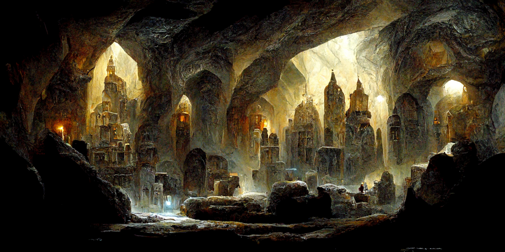
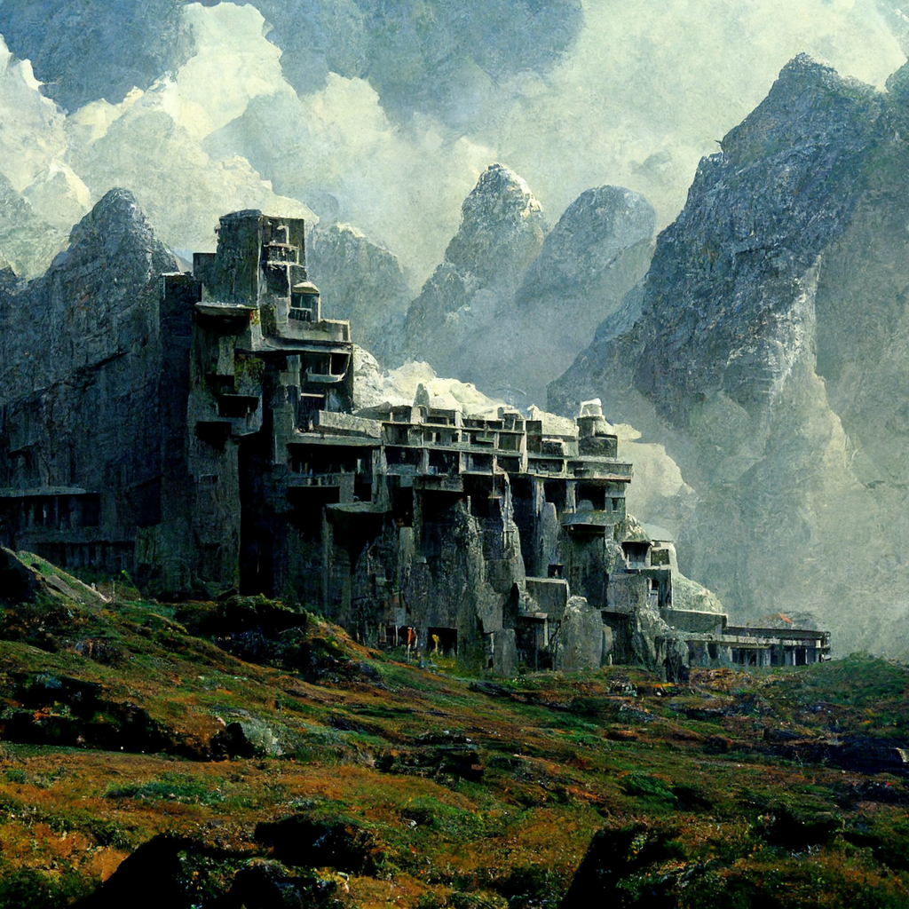

# Dwarf

This page contains lore information about dwarves. For details on character creation and playing a dwarf, see [Playing a Dwarf](<../../../campaigns/mechanics/species/playing-a-dwarf.md>).

> [!quote] Dwarven Prayer of Naming, excerpt
> Far under the mountains, long ago the First were made from solid stone. Born to delve and craft and seek, the [Bahrazel](<../../../cosmology/gods/embodied-gods/bahrazel.md>) made our mountain homes: Uzdan, the Ruler, leader of people; Karthel, the Runecrafter, shaper of magic; Fanrukel, the Priest, keeper of lore; Tarbaka, the Stoneworker, lord of the forge; Azar, the Warrior, defender of cities; Maganna, the Traveler, delver and miner; and Oshkir, the Farmer, provider and healer. May their wisdom and protection guide you to your name and place. See now the past and the future as one.

Deep in the mountains, a glittering hall of crystal and light, enchanted with glowing runes. The echoes of hammers and picks delving for silver, forging iron and steel; and the slow tap-tap-tap of a crafter carefully shaping a cave of wonder beneath the mountains. Towering stone fortresses in the hills, full of beautiful stonework and ancient runes of power and protection. An abiding commitment to clan and family and thuhr. These are the common threads of dwarven life. 

### Short And Strong

Bold, brave (sometimes to the point of foolhardiness) and hardy, dwarves are renowned for their skill in battle and as artisans of stone and metal. Though dwarves are short and stocky, averaging 4 to 4 ½ feet, and rarely growing taller than 5 feet, their muscular build means they often weight as much as a human 2 feet taller.

Their appearance is as varied as the stones they shape: though many have ruddy complexions, with dark or red hair and brown or tan skin, dwarves of all colors are regularly seen in Taelgar. Most dwarven men, and some dwarven women, grow long beards, which they braid with intricate ribbons. As dwarves age, their hair, including their beards, generally turns gray or white, and their faces acquire deep wrinkles, especially around the eyes.

Dwarves mature at a little more slowly than humans. Dwarves typically reach physical maturity at around the age of 25, but are not considered full adults until they reach their age of majority at 36 and make a pilgrimage to [Heart of the Mountain](<../../../cosmology/multiverse/spiritual-realms/divine-realms/heart-of-the-mountain.md>) to receive their name and thuhr. Dwarves have a long lifespan, often reaching 300 years.
### Bound By Tradition

Dwarves can live to be hundreds of years old, and like the mountains of their home they endure change stoically, holding tightly to their long traditions and history. Even dwarves who do not live in their homelands generally honor their ties to their ancestors, and dwarven settlements far from their original homelands nonetheless maintain ties to clan and kingdom.

Many dwarves can recite family histories going back thousands of years, to the early days of the Taelgar, the triumphs and defeats the wars of the first ages of the world, and the bitter memories of the Sundering, when the dwarven race was divided by conflict, and many dwarves left in exile. This long memory gives dwarven society tendency to always be looking backwards; for some dwarves, this becomes a deep nostalgia for the glory days of yore.
### The Bahrâzel

As one of the Elder races of Taelgar, the Dwarves were created by the [Bahrâzel](<../../../cosmology/gods/embodied-gods/bahrazel.md>), the embodied gods of the Dwarves and the mystical firstborn of their race. Legend says the seven [Bahrazel](<../../../cosmology/gods/embodied-gods/bahrazel.md>) were created from living rock, given form and magic and empowered to create the dwarven people in their image. The [Bahrazel](<../../../cosmology/gods/embodied-gods/bahrazel.md>), the seven gods of the dwarves, play a significant role in dwarven society. They are worshipped as the creators of the dwarven race, and many dwarves will call upon the [Bahrazel](<../../../cosmology/gods/embodied-gods/bahrazel.md>) in times of stress and danger, with a quick prayer for intercession; they are the patrons and protectors of the race. While they have individual identities, many dwarves worship the [Bahrazel](<../../../cosmology/gods/embodied-gods/bahrazel.md>) as a whole, thinking of the seven gods as aspects of one divinity. The reality of the [Bahrazel](<../../../cosmology/gods/embodied-gods/bahrazel.md>) is much debated in dwarven theological circles.

### The Living Mountain

This connection to mountains is expressed most strongly in the home of the [Bahrazel](<../../../cosmology/gods/embodied-gods/bahrazel.md>), [Heart of the Mountain](<../../../cosmology/multiverse/spiritual-realms/divine-realms/heart-of-the-mountain.md>). [Heart of the Mountain](<../../../cosmology/multiverse/spiritual-realms/divine-realms/heart-of-the-mountain.md>) is a mystical place, another plane of existence entirely that most dwarves only experience during the ritual of name-taking, when a young dwarf around the age of maturity goes on a pilgrimage to recieve their adult name and thuhr. There are no maps, and few people find it in the same place, but all dwarves find it eventually, after wandering through the passages of their people and the natural passages beneath the mountains.

[Heart of the Mountain](<../../../cosmology/multiverse/spiritual-realms/divine-realms/heart-of-the-mountain.md>) is often describe as a massive hall, formed in the shape of a ribcage, but it changes and reshapes itself so no description is ever exactly the same, and many dwarves find the place hard to describe. It is the incarnation of the stone itself, the place where the mountains are alive. When a dwarf finds the chamber during the ritual of name-taking, they usually experience a vision of a significant moment in their lives, learning their thuhr at the same time. At death, dwarves hope to be returned to [Heart of the Mountain](<../../../cosmology/multiverse/spiritual-realms/divine-realms/heart-of-the-mountain.md>) and their name is carved upon the walls of the chamber, to live in the mountains in perpetuity with the [Bahrazel](<../../../cosmology/gods/embodied-gods/bahrazel.md>).
### Thuhr

All adult dwarves who have completed their naming rite are also a member of a thuhr, a uniquely dwarven institution that is a combination of a guild, a secret society, a mentorship system, and a place to find family outside the traditional strictures of the dwarven clan. There are seven thuhr, each associated with one of the [Bahrazel](<../../../cosmology/gods/embodied-gods/bahrazel.md>): Ruler, Runecrafter, Priest, Warrior, Traveler, Stoneworker, and Farmer. A dwarves' thuhr is revealed to them during the ritual of name-taking at the age of maturity, when they find [Heart of the Mountain](<../../../cosmology/multiverse/spiritual-realms/divine-realms/heart-of-the-mountain.md>) and experience the divine revelation of the [Bahrazel](<../../../cosmology/gods/embodied-gods/bahrazel.md>).

When a young dwarf learns their thuhr, they will usually apprentice to an elder of the same thuhr to learn a vocation, often traveling far from home for this purpose. The thuhr connect dwarves across clans, and play an important role in keeping dwarven society peaceful and resolving conflicts between clans. Rare Binthuhr dwarves (adults who never completed their pilgrimage to [Heart of the Mountain](<../../../cosmology/multiverse/spiritual-realms/divine-realms/heart-of-the-mountain.md>), and thus never learned their thuhr) challenge the strict traditions of the race and are usually outcasts from dwarven society.
#### Slow To Trust

Dwarven kingdoms are generally friendly to other races, but are rarely close allies. They tend to treat “younger” races, especially [Halflings](<../halflings/halflings.md>) and humans, as valuable members of the kingdom, but generally still as outsiders.

However, dwarven kingdoms are often close allies with the Stoneborn, who share their mountain home and a long history of alliance in battle.

Dwarven kingdoms rarely have extensive relations with elven society. Although dwarves generally treat [elves](<../elves/elves.md>) as elders due respect, their rulers and diplomats tend to tire of the [elves](<../elves/elves.md>) haughty attitudes quickly, as dwarves do not see themselves as children of the world.
### Clans, Kings, and Cities

Dwarven society is generally conserative and strongly hierarchical, organized around ties of honor among kin, thuhr, and clan. Family units tend to live close together in large extended families, and any dwarves’ first loyalty is to the matriarch or patriarch of their family. Dwarven kingdoms stretch deep underground, connecting dwarves to the mineral wealth of the mountains that is the source of much of their livelihood and trade. Some dwarven kingdoms spread extensively above ground, reaching into the foothills and valleys of their mountain homes. Members of other races, especially halflings, stoneborn, and humans, often live in these above ground settlements harmoniously, yet are rarely treated as a full part of the community. Despite their close knit societies, many dwarves have chosen to live among humans in their cities, where they are often skilled artisans or sought-after as mercenaries or bodyguards.

In the west of Taelgar, there are five great Dwarven Kingdoms:

- Fahnukan, in the far north, isolated since before the Great War, the home to strange dwarves who sculpt in ice and relish the cold.
- Nidzahar, the largest and richest of the five kingdoms, building great cities on the mountain slopes as centers of trade and industry, and growing rich of the prosperous trade connections with Sembara to the east.
- Am'khazar, on the western side of the great mountains, small but proud of their mineral wealth and skill in gem-cutting, especially in their largest city, Zarkandur, the City of Gems.
- Khatridun, a small but ancient kingdom south of Nidzahar and east of Am'khazar, the remnants of one of the great dwarven empires of the Elder days, now much reduced due to the losses and destruction of the Great War
- [Nardith](<../../../gazetteer/greater-dunmar/realms/nardith/nardith.md>), far to the south in the [Yuvanti Mountains](<../../../gazetteer/greater-dunmar/yuvanti-mountains.md>), a new kingdom founded by refugees fleeing the devastation of the Great War and the old kingdom of Ardith, now growing rich on trade with Chardon and [Dunmar](<../../../gazetteer/greater-dunmar/realms/dunmar/dunmar.md>).

#### Dwarven Names
A dwarf’s name is revealed to them when they find the Heart of the Mountain, and holds a deep place in the traditions of clan and caste. All dwarf names are used and reused over centuries and revered down the generations. Young dwarves who have not made their pilgrimage yet (and are thus caste-less and nameless) go by diminutive nicknames given by their parents.  

Dwarves ascribe meaning to their clan names and often render them in the trade tongue when introducing themselves, and thus these clans are presented in English here. This tradition is not universal, and of course some dwarves may introduce themselves with dwarven clan names.
  
**Male Names:** Adrik, Alberich, Baern, Barendd, Brottor,  Bruenor, Dain, Darrak, Delg, Eberk, Einkil, Fargrim, Flint, Gardain, Harbek, Kildrak, Morgran, Orsik, Oskar, Rangrim, Rurik, Taklinn, Thoradin, Thorin, Tordek,  Traubon, Travok, Ulfgar, Veit, Vondal

**Female Names:** Amber, Artin, Audhild, Bardryn, Dagnal, Diesa, Eldeth, Falkrunn, Finellen, Gunnloda, Gurdis, Helja, Hlin, Kathra, Kristryd, Ilde, Liftrasa, Mardred, Riswynn, Sannl, Torbera, Torgga, Vistra

**Child Names:** Adi, Art, Bar, Brot, Dag, Del, Ein, Eld, Gunn, Kat, Kel, Mar, Osk, Ris, Rur, Tak, Tor, Tra, Ulf, Von, Vis

**Clan Names:** Battlehammer, Boulderlock, Brawnanvil, Cragfire, Deepmine, Fireforge, Frostbeard, Goldborn, Hardcrown, Highkeep, Ironfist, Redbeard, Rockhammer, Sparkhorn, Stronghelm, Stoneaxe

