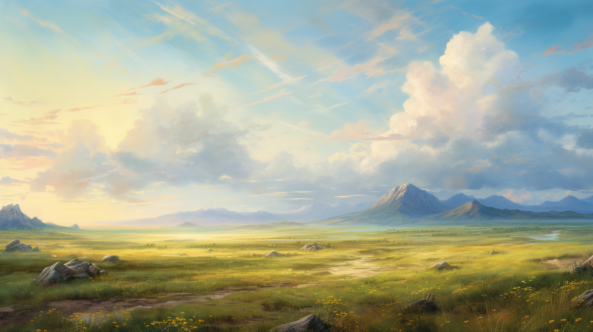

# Centaurs

This page contains lore information about centaurs. For details on character creation and playing a centaur, see [Playing a Centaur](<../../campaigns/mechanics/species/playing-a-centaur.md>). 

>[!quote] Centaur creation myth
*Long ago, before the form of the world was fixed, we walked the ever-changing land, mindless and soulless, empty but for the whims of the Archfey. Yestare, the Beginning, and Mettare, the Ending, stepped into this chaos, and spoke words of separation, words of renewal, words of power to fix the form of the world and bring meaning to the chaos. In this timeless moment of sundering, when the lands of the Archfey were pulled away from the world, the World reached out, and chose us to be its guardians.*
>
*Taelgar itself gave us life, a purpose, freedom and souls, an act of need to ensure the land was not forgotten, an act not of the gods, even Yestare and Mettare, but of a higher purpose.In that moment, we awoke to our new selves. Our hoofbeats were the first to stride across the new world, fixed in form. Our souls were the first to be made, not by any god or power but by the need of the land itself.*

Striding across the open plains of the south, their hoofbeats ringing, a herd of centaurs turns north, following the winds and weather. The gentle strum of a harp as voices raise in song, in praise of the earth, around a campfire. The cycle of migrations, following the seasons across Taeglar. These are the rhythms of the centaur life. 
## The Horse Lords
With the torso, arms, and head of a human, and the four legs and body of a horse, centaurs are a blend of strength and grace. Typically standing 6 or 7 feet tall, with their equine bodies reaching 4 feet at the withers, centaurs are an imposing presence. They can run quickly, for miles, carrying a heavy load, and without tiring. While all centaurs share the same form, their appearance is otherwise as varied as the natural world they love.
## A Fey Heritage
Centaurs trace their origin to the archfey, and retain a fey heritage. Despite their deep connection to the fey, most centaur consider themselves to have broken free of the constraints of their fey ancestors, and consider the world of Taelgar to be their true creator, not the Archfey who shaped their form. 
## A Migratory People
Centaur societies are usually migratory, traveling on long migration routes that can take years to complete, sometimes even generations. Some centaur societies shape their travels to seek new marvels of the natural world, while others follow the time-honored paths of generations. While they will sometimes spend a season or a year in one place, building temporary camps and tending the local land, few centaurs build cities or other permanent structures. 
## Guardians of Taelgar
Centaurs usually do not worship gods, giving thanks and prayers to the world itself instead. Many centaurs view themselves as the protectors and guardians of the natural world. Never numerous, they have little power to stop human cities or empires from spreading, and don’t try. Instead, they try to heal what they can when they see the world is damaged. 

Their veneration of Taelgar also manifests itself in other ways. Many centaurs feel uneasy when they are not in contact with the ground, so second stories, ships, and even buildings with stone floors may make them uncomfortable. Centaurs tend to have a very light touch on the land, generally building no buildings and plowing no fields. Centaurs gather food from the land, trusting the bounty of the world to sustain them on their long migrations, supplemented with trade.

Many centaurs exploit this connection with the world of Taelgar to read the signs and echos and portents in the world, and other species often seek out centaurs for their skill in prophecy and divination. 
    
