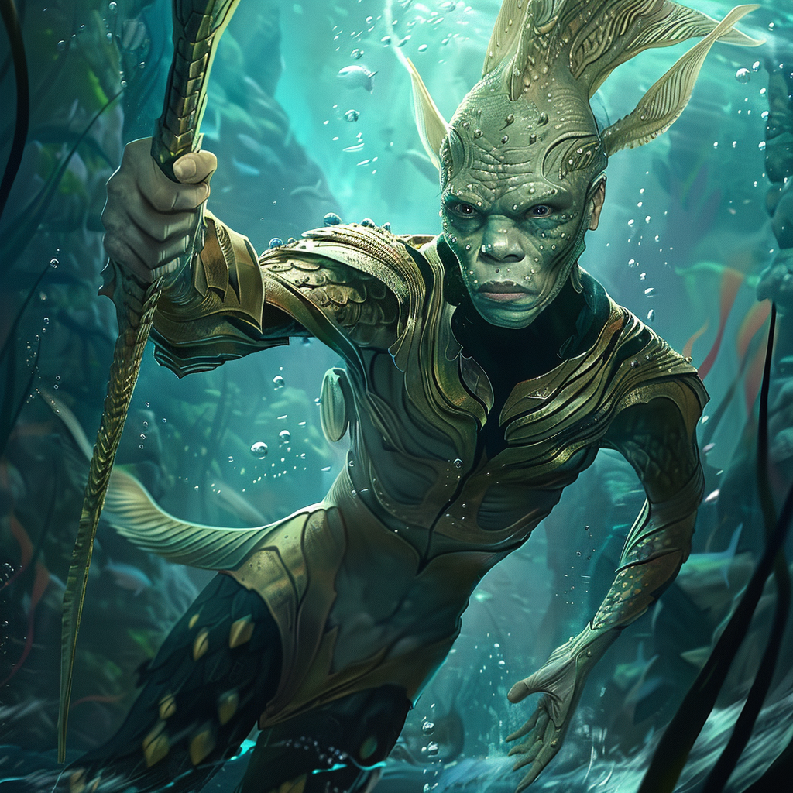

# Merfolk

At home in the depths of the ocean, swimming beneath the waves, merfolk tend kelp gardens and flocks of manta rays, hidden from the surface world. They are the people of the ocean, alien and strange to land-dwellers, in tune with the changeable moods of the ocean.
## Waterborn
{align="right"; width="200"}Despite a basic bipedal body plan, merfolk are extremely adapted to living underwater. Able to breath water and air with equal ease, merfolk have long webbed fingers, elongated, flipper-like feet, and large eyes adapted to the murky light of the deep ocean. Beyond these basic features, merfolk are as diverse and variable as the fish of the ocean.
## Children of the Ocean
Merfolk trace their origin to the Sentient Ocean, a powerful psychic alien entity from an unknown plane. Created by the sentient ocean in the days of legend when magic was strong, the merfolk retain an intimate connection to the magic of the sentient ocean. It is said that merfolk can speak to each other across vast distances, control water and storms, and can even act together with uncanny coordination. 
## At Home Underwater
Merfolk make their homes beneath the ocean, typically constructing village and even cities out of coral, rock, and tough fibers woven from seaweed, especially kelp. They rarely seek contact with surface dwellers, and even fewer surface dwellers visit their cities. Most merfolk settlements are self-sufficient, and the limitations of their underwater mean that they work no metal, and have no writing. 

