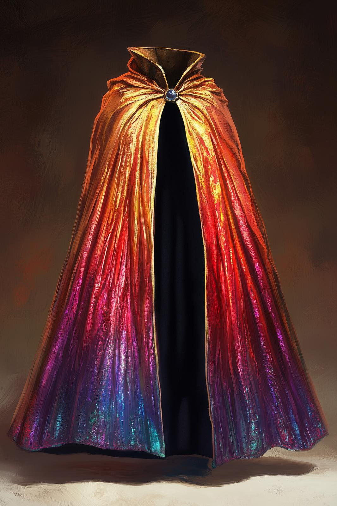

# The Cloak of Rainbows

- :octicons-info-24:{ .lg .middle } __Unique Magical Cloak__  
   Created DR 917 (832 years ago)  
   Created by [Cloudspinner](<../../people/extraplanar-powers/archfey/cloudspinner.md>), in [Amberglow](<../../gazetteer/extraplanar/feywild/amberglow/amberglow.md>), the [Feywild](<../../cosmology/feywild.md>)  
   Owned by [Chief Lubash](<../../people/orcs/lubash.md>)  

{align="right"; width="300"}The Cloak of Rainbows is a multi-colored shimmering cloak, made of the threads of sunset woven by the [Cloudspinner](<../../people/extraplanar-powers/archfey/cloudspinner.md>), and enchanted with powerful magic to shield the wearer from the sight and power of the Divine. The colors change with the light and the sun, shifting darker or lighter seemingly with the whims of fate. 

[Cintra](<../../people/dunmari/cintra.md>) believed [Agata](<../../people/fey/agata.md>) was searching for it, and had heard it was supposedly created by [Apollyon](<../../people/historical-figures/drankorian-emperors/apollyon.md>), but the truth is more complicated. The history of the Cloak of Rainbows is intimately connected with the history of the [People of the Rainbow](<../../groups/orc-hordes/people-of-the-rainbow.md>). It was originally a gift to allow these orcs to live free of [Thark](<../../gods-and-religions/gods/embodied-gods/thark.md>)'s gaze. It was stolen by [Apollyon](<../../people/historical-figures/drankorian-emperors/apollyon.md>), and then lost, and [rediscovered](<../../campaigns/dunmari-frontier-campaign/letters-and-notes/letter-from-govir.md>) by the Dunmari in the years before the Great War, only to be lost again during the Great War. 

Now, it is worn by the chiefs of [Xurkhaz](<../../gazetteer/upper-istaros/xurkhaz/xurkhaz.md>), currently Chief [Lubash](<../../people/orcs/lubash.md>). 

The power of the cloak has allowed, with hard work over the years, the [People of the Rainbow](<../../groups/orc-hordes/people-of-the-rainbow.md>) to construct a magical barrier around [Xurkhaz](<../../gazetteer/upper-istaros/xurkhaz/xurkhaz.md>), a barrier that prevents [Thark](<../../gods-and-religions/gods/embodied-gods/thark.md>) from acting, seeing, or in any way influencing events in [Xurkhaz](<../../gazetteer/upper-istaros/xurkhaz/xurkhaz.md>). Not only does this keep the orcs of [Xurkhaz](<../../gazetteer/upper-istaros/xurkhaz/xurkhaz.md>) safe from Thark's spying, it means that chained orcs, as they call the orcs still ensnared by Thark's magic, will not willingly enter [Xurkhaz](<../../gazetteer/upper-istaros/xurkhaz/xurkhaz.md>). 

The cloak also has the power to silence divine magic in a wide radius, should the wearer wish it. 

