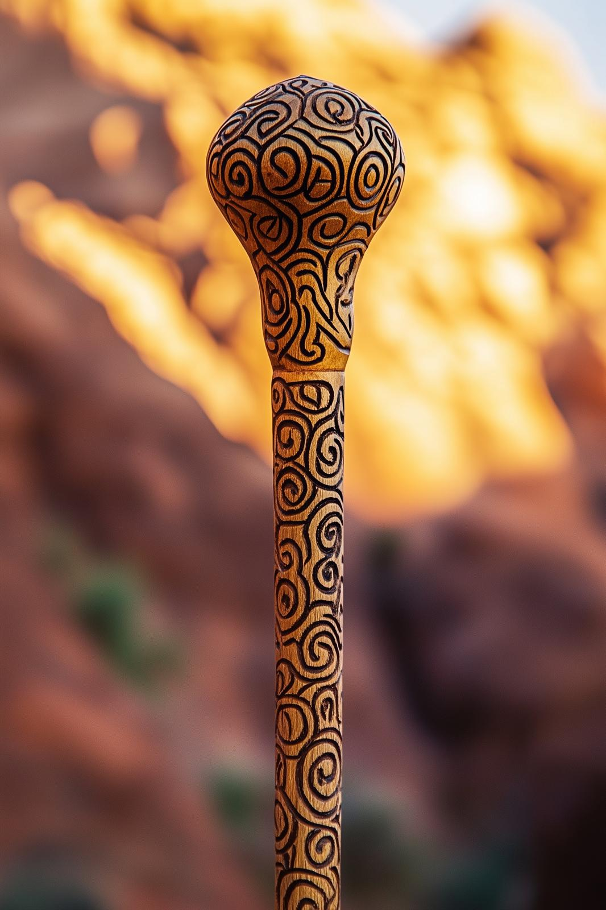

# The Dreamweaver Staff

- :octicons-info-24:{ .lg .middle } __Unique [Dunmari](<../../gazetteer/greater-dunmar/realms/dunmar/dunmar.md>) Staff__  
   Owned by [Candrosa](<../../people/dunmari/candrosa.md>)  

{align="right"; width="300"}The Dreamweaver Staff is a carved wooden staff with an intricate pattern of swirling shapes. It has been carried by the Speaker of the [Shakun Mystai](<../../groups/dunmari-mystery-cults/shakun-mystai.md>) for many generations, and is said to be able to allow the bearer to manipulate dreams. It is even possible, supposedly, to transport subjects into the [Dreamworld](<../../cosmology/dreamworld.md>) with this staff. 

Currently, this staff is carried by [Candrosa](<../../people/dunmari/candrosa.md>), and was used by Candrosa after the return of the [Heart of Shakun](<./heart-of-shakun.md>) to send the members of the [Dunmar Fellowship](<../../people/pcs/dunmar-fellowship/dunmar-fellowship.md>) on journeys to the [Dreamworld](<../../cosmology/dreamworld.md>)

