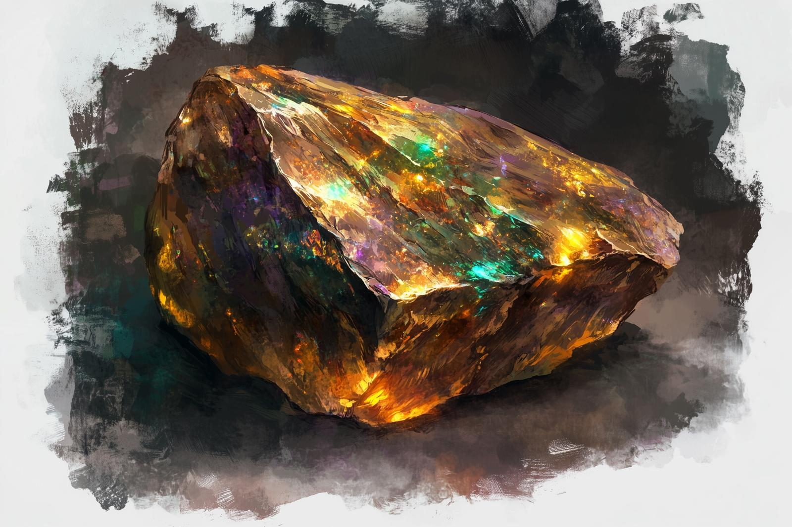

# The Heart of Shakun

- :octicons-info-24:{ .lg .middle } __Unique Wonderous Item__  
   Owned by [Cintra](<../../people/dunmari/cintra.md>)  

{align="right"; width="400"}The Heart of Shakun, at first glance, appears to be nothing more than a rough hewn piece of ochre, about the size of a fist. The more one watches it, though, the stranger it appears. It pulses slightly, almost imperceptibly, with a slow, regular rhythm, one beat a minute or so, getting just a bit larger then just a bit smaller. Across the surface, multihued veins run -- all muted, a bit, green and bronze and purple, like etchings done with powdered gemstones of emerald and amber and amethyst, but faint and barely visible below the surface of the rock itself. These veins seem to sparkle, and flow, gradually dancing over the surface of the stone in a mesmerizing dance, hard to perceive and yet once you notice it, hard to look away from.

It functions as a locus for the power of [Shakun](<../../gods-and-religions/gods/incorporeal-gods/dunmari-pantheon/shakun.md>) on the material plane, and must remain in the [Red Mesa](<../../gazetteer/greater-dunmar/realms/dunmar/eastern-dunmar/red-mesa.md>), the physical embodiment of [Shakun](<../../gods-and-religions/gods/incorporeal-gods/dunmari-pantheon/shakun.md>) in this world, in order to function as the heartbeat of the [Shakun Mystai](<../../groups/dunmari-mystery-cults/shakun-mystai.md>) and allow [Shakun's Protection](<../../gods-and-religions/religions/five-siblings/shakun-s-protection.md>) to be maintained on the eastern borders of [Dunmar](<../../gazetteer/greater-dunmar/realms/dunmar/dunmar.md>). 