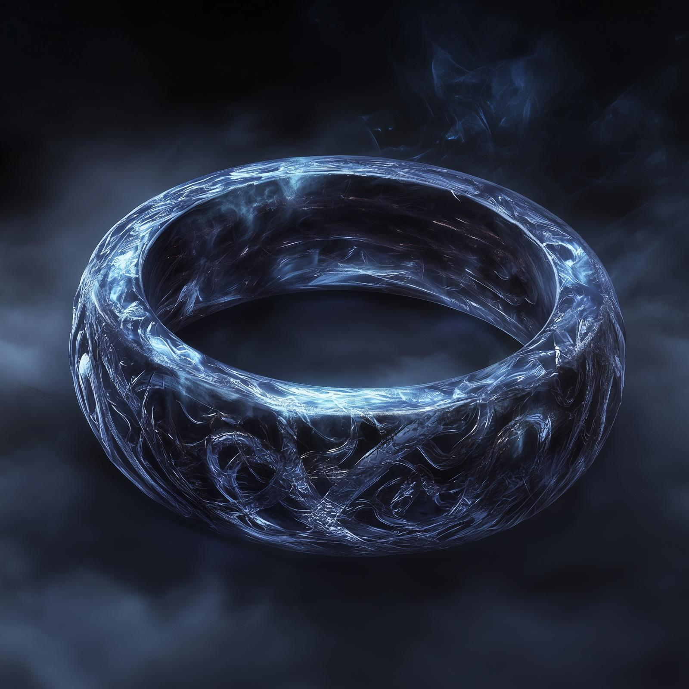

# The Ring of Undying

- :octicons-info-24:{ .lg .middle } __Unique Ring__  
   Destroyed by [Wellby](<../../people/pcs/dunmar-fellowship/wellby.md>) on January 20th, 1749  
   Was owned by: [Grash](<../../people/other-nonhumans/grash.md>)  

{align="right"; width="400"}A ring, worn by [Grash](<../../people/other-nonhumans/grash.md>), that supposedly lets one cheat death forever, and control death around you. Presumably the source of [Grash](<../../people/other-nonhumans/grash.md>)'s ability to resurrect dead [Orcs](<../../species/orcs.md>) into undead. 

The ring was rumored to have been created by an ancient elven wizard from the early days of the world, before humans walked Taelgar. It was made by binding the very substance of the [Land of the Dead](<../../cosmology/land-of-the-dead.md>) into a ring, that gave one power over life and death itself. 

How this elf lost the ring is not told, but it reappeared in Drankor, during the golden age, to much consternation. The ring, it is said, would draw the life force of anyone near the wearer when the wearer died, using this life energy to keep the wearer from dying. An attempt was made to destroy it, but it failed, and the ring was lost again. 

The ring of undying was [ultimately destroyed](<../../campaigns/dunmari-frontier/session-notes/session-88-dufr.md>) during the [Battle for Uzgukhar](<../../events/1700s/1749/battle-for-uzgukhar.md>), by [Wellby](<../../people/pcs/dunmar-fellowship/wellby.md>) of the [Dunmar Fellowship](<../../people/pcs/dunmar-fellowship/dunmar-fellowship.md>). 
