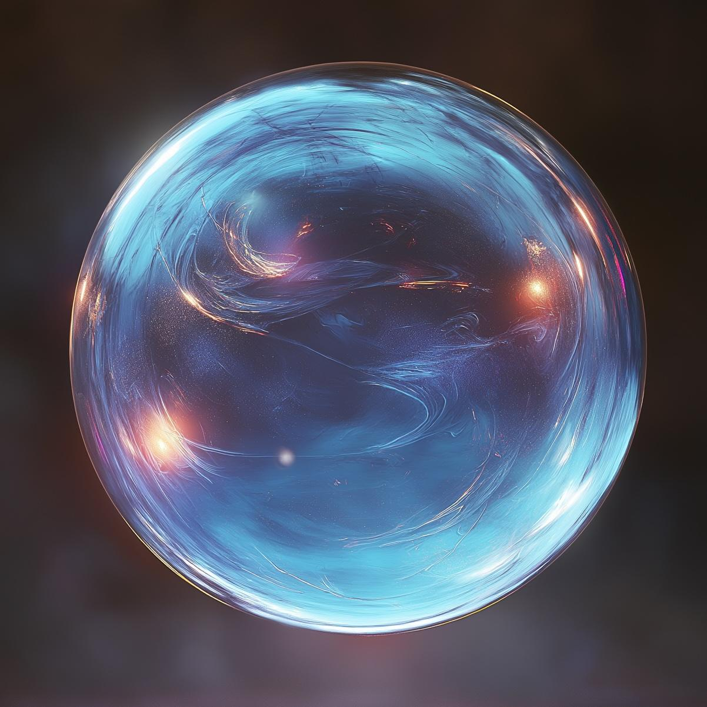

# Driftglobe

- :octicons-info-24:{ .lg .middle } __[Dwarven](<../../species/dwarves.md>) Magic Wondrous Item__  
    :simple-dungeonsanddragons:{ .middle} [Mechanics](https://www.dndbeyond.com/magic-items/5349-driftglobe) 

A driftglobe is a magical crystal, usually around 4 inches across, that floats and creates light. These crystal spheres are of Dwarven creation, originally enchanted to light their caverns underground, but many have found their way out of dwarven cities and across the world. 

{align="right"; width="300"}{align="left"; width="300"}

The [Dunmar Fellowship](<../../people/pcs/dunmar-fellowship/dunmar-fellowship.md>) found two of these in the [dwarven outpost](<../../gazetteer/greater-dunmar/dunmari-basin/dwarven-outpost-raven-s-hold.md>) near [Raven's Hold](<../../gazetteer/greater-dunmar/dunmari-basin/raven-s-hold.md>). These two were made by the dwarves living near Raven's Hold in the generation before the Great War, and were recovered from that outpost.
