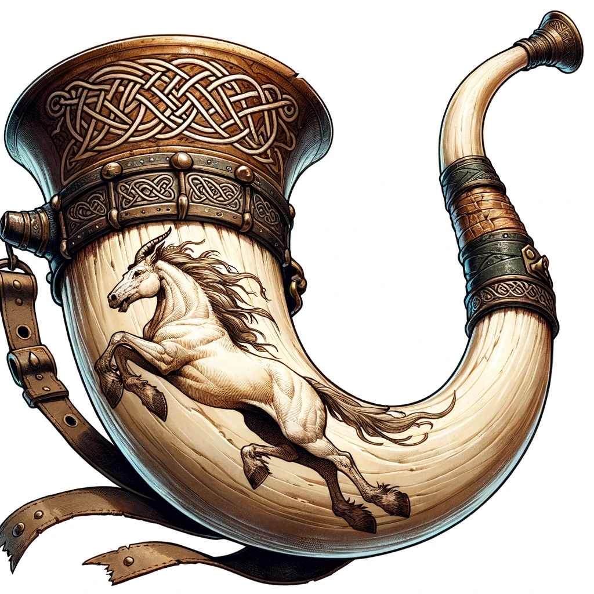
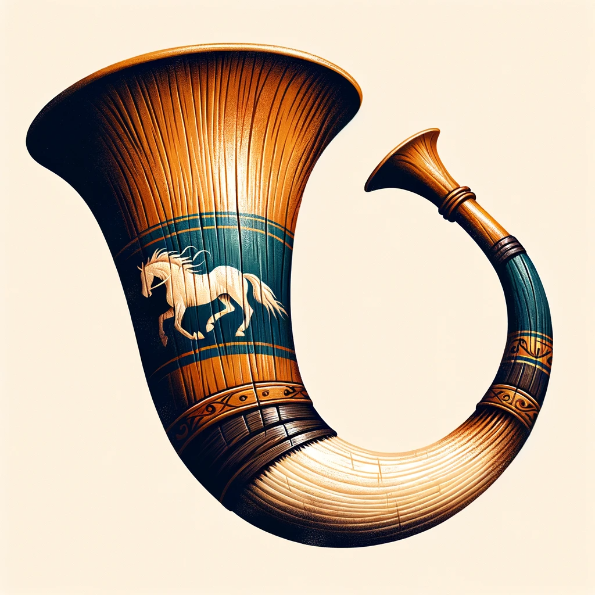

# Horn of Silent Alarm (Dunmari)

- :octicons-info-24:{ .lg .middle } __Common [Dunmari](<../../gazetteer/greater-dunmar/realms/dunmar/dunmar.md>) Magic Horn__  
    :simple-dungeonsanddragons:{ .middle} [Mechanics](https://www.dndbeyond.com/magic-items/horn-of-silent-alarm) 

A common magic item created in large numbers by the Dunmari during the [Dharajun Dynasty](<../../groups/dunmari-dynasties/dharajun-dynasty.md>), especially in the years before and during the [Great War](<../../events/1500s/great-war.md>). Typically carried by Dunmari scouts and outriders, and used to alert trailing forces of danger. These items are often associated with the blessings of [Chidya](<../../gods-and-religions/gods/incorporeal-gods/dunmari-pantheon/chidya.md>). Although a variety of designs are common, all feature a horse motif.

{align="left"; width="300"}{align="right"; width="300"}

The [Dunmar Fellowship](<../../people/pcs/dunmar-fellowship/dunmar-fellowship.md>) has found two of these horns.

One, carried by [Delwath](<../../people/pcs/dunmar-fellowship/delwath.md>), [was taken](<../../campaigns/dunmari-frontier/session-notes/session-45-dufr.md>) from [Justan](<../../people/dunmari/justan.md>), a perhaps-reformed Dunmari bandit, after he and his companions were cruelly murdered by [dastardly](<../../people/chardonians/casian.md>) [Chardonians](<../../people/chardonians/kadmos.md>).

A second, once carried by [Kenzo](<../../people/pcs/dunmar-fellowship/kenzo.md>), [was found](<../../campaigns/dunmari-frontier/session-notes/session-3-dufr.md>) in the ruined Dunmari [fort](<../../gazetteer/greater-dunmar/dunmari-basin/dunmari-fort-gomat.md>) east of the [Gomat](<../../gazetteer/greater-dunmar/dunmari-basin/gomat.md>) oasis, on the body of Dunmari scout who apparently died more than a hundred years ago. This horn has an etched running horse design. It was [sacrificed](<../../campaigns/dunmari-frontier/session-notes/session-69-dufr.md>) as part of the ritual to free [Kenzo](<../../people/pcs/dunmar-fellowship/kenzo.md>) from the cursed soul chain that [he acquired](<../../campaigns/dunmari-frontier/session-notes/session-57-dufr.md>) while freeing [Motua](<../../people/extraplanar-powers/motua.md>).
