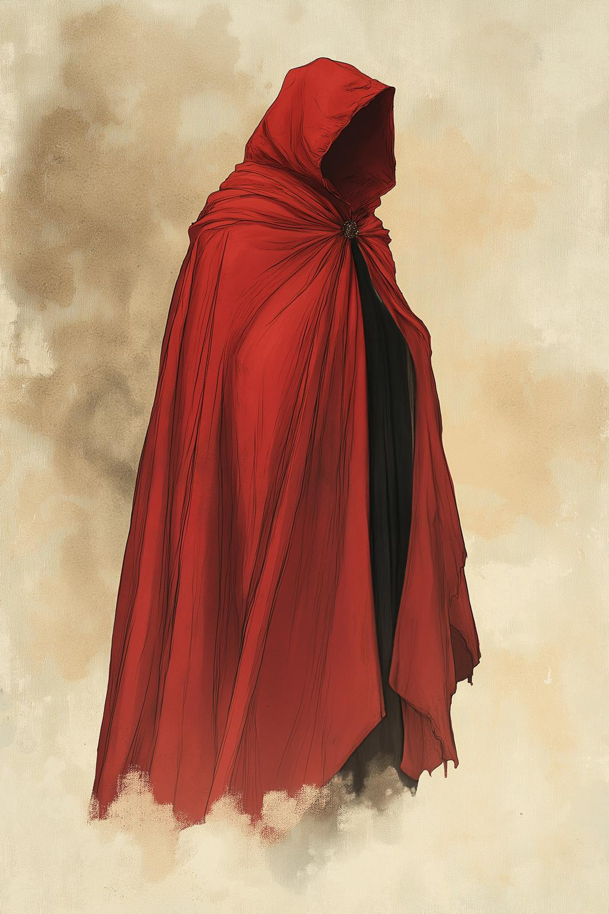

# Tollen Dyes
:octicons-info-24:{ .lg .middle } **Material**  

{align="right"; width="300"}The city of Tollen is famous for producing a variety of dyes, both [magical](<../magic-items/tollen-magical-tattoo.md>) and mundane. The most distinctive of these is Tollen red, a brilliant, bright vermillion red with excellent color fastness, used in particular to make distinctive bright Tollen red cloaks. 