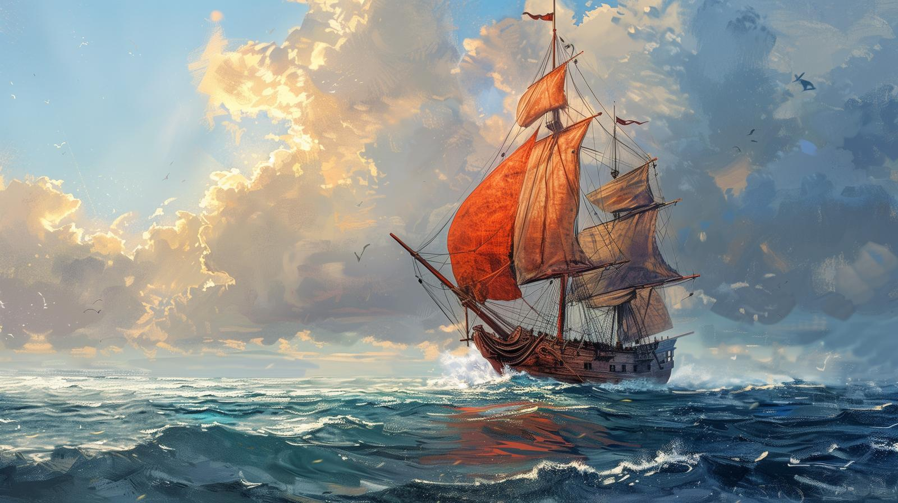

# The Summer's Breeze

- :octicons-info-24:{ .lg .middle } __[Halfling](<../../species/halflings.md>) Boat__  
   Home area: the [Gulf of Chardon](<../../gazetteer/greater-chardon/gulf-of-chardon.md>), the [Endless Ocean](<../../gazetteer/endless-ocean.md>)  

A spritely halfling trader, sailing a meandering route around the [Gulf of Chardon](<../../gazetteer/greater-chardon/gulf-of-chardon.md>), going where the winds and tides lead. Captained by [Pippa Goodbarrow](<../../people/halflings/pippa-goodbarrow.md>), and crewed by a lively group of mostly young halflings, with a distinct preference for fine food, regular meals, and good ale. 

Unlike many halfling trading ships, this is not really a family operation.

