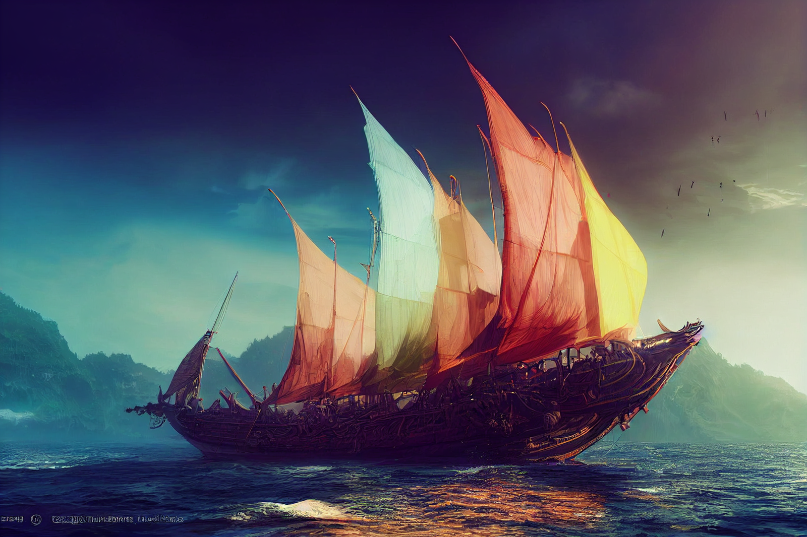

# The Wave Dancer

- :octicons-info-24:{ .lg .middle } __[Halfling](<../../species/children-of-the-embodied-gods/halflings/halflings.md>) Boat__  
   Home area: the [Eastern Green Sea](<../../gazetteer/eastern-green-sea/eastern-green-sea.md>), the [Green Sea](<../../gazetteer/green-sea.md>)  

A halfling ship plying the trade routes of the eastern Green Sea, regularly visiting [Praznitsky](<../../gazetteer/northern-green-sea/praznitsky.md>), [Wahacha](<../../gazetteer/eastern-green-sea/wahacha.md>), [Quanyi](<../../gazetteer/eastern-green-sea/quanyi.md>), and [Medju](<../../gazetteer/eastern-green-sea/medju.md>).  
## Crew
[Wella Brightmoon](<../../people/halflings/wella-brightmoon.md>), captain and matriach of the family
[Rose Brightmoon](<../../people/halflings/rose-brightmoon.md>), musician and Wella's wife
[Pearl Brightmoon](<../../people/halflings/pearl-brightmoon.md>), first mate and captain of the guard
[Corrin Wildheart](<../../people/halflings/corrin-wildheart.md>), navigator
[Lerry Wildheart](<../../people/halflings/lerry-wildheart.md>), quartermaster

{width="500"}

