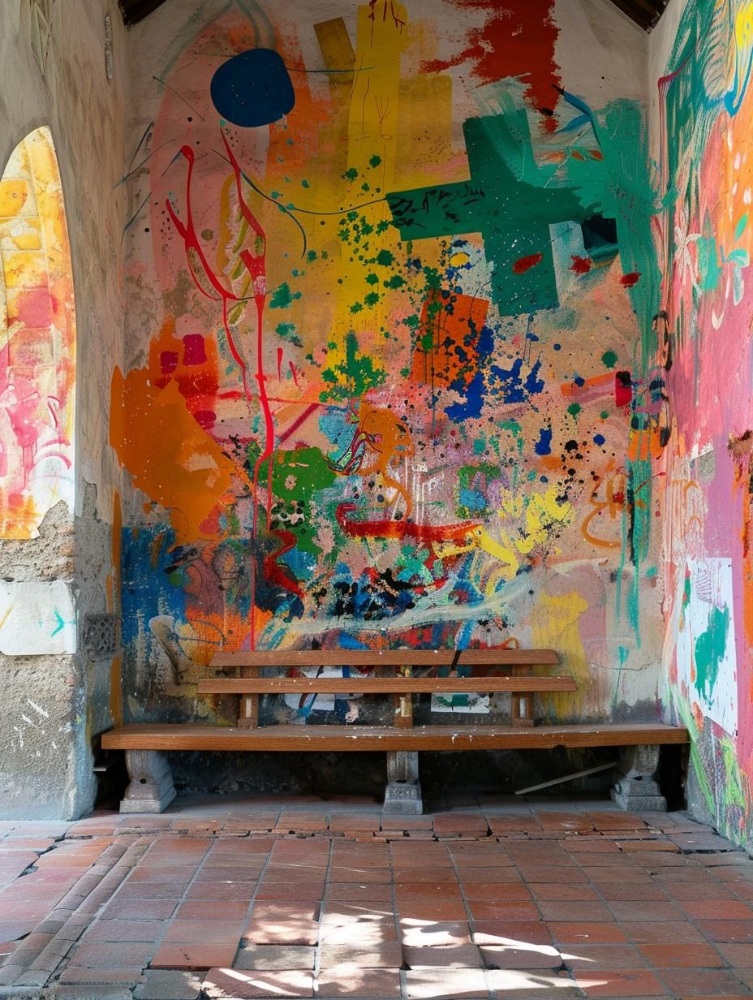

# The Miracle of the Hopeful Heat

> Once, many many years ago, the winter was extraordinarily cold, and when Pyravella came, a blizzard struck. It snowed for seven days, and the wood started to run out, and the people were freezing. As the heaths went cold, the people gathered in the manor hall. As the blizzard continued into the second week, desperation set in, and the village grew worried, and cold. Some suggested striking out through the snow for Cleenseau (it was not called Cleenseau in those days, but there has always been a town by the bridge). But a young girl stood up and started preaching hope and as she spoke the wall behind her grew colors and streaks, and these radiated heat. The Wyrdling had granted a miracle of hope, and the heat of the colors kept the people alive through the next two nights, until the storm broke. This same wall is now part of the temple here.

{width="500"} 
  
The painting on the wall of the temple still feels warm, sometimes, if you bring your hand close to it on a cold day. 

Recently, on this very feast day, [El](<../../people/sembarans/el.md>) protected a group of villagers from zombies who were sheltering in the temple.