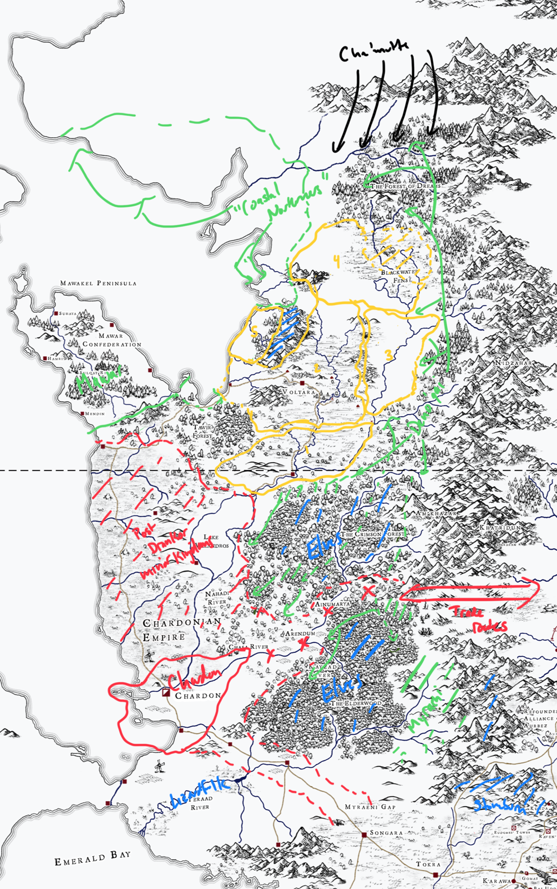
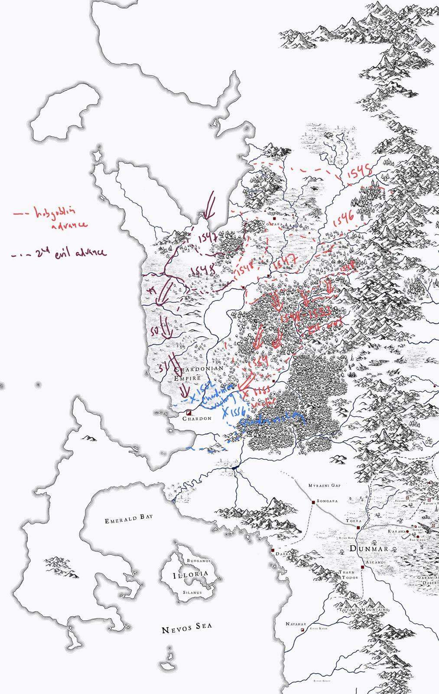

Some notes on the West Coast history

## Before the Great War

Rough map (map should not be considered completely canonical)

The basic logic is that when Drankor falls, a lot of academic power moves to Chardon, which becomes a power base for the region, but is, at this time, not a military or naval power, particularly. But it is centrally located on both the major trade route with Sembara and with Dunmar. 

Probably Chardon controls, at least in some loose sense, much of the Chasa river valley, and possibly some of the Yeraad watershed as well. Chardon likely does not control the canal, or the coast of the Emerald Bay. 

North of Chardon you have a variety of as-yet-undeveloped minor kingdoms in the fertile agricultural land on the coast between Chardon and Mawar. These might be kind of like various German states, perhaps even with a kind of holy-roman-empire-like superstructure, but this is highly undeveloped. 

North of Lake Valandros, you have five more well-developed realms. These are somewhat less Drankorian in style and influence, although still worshipping Mos Numena and speaking Common. 

The only two that have names or any details are what is marked 2 and 3 in yellow.

Kingdom 2 (centered on modern-day Voltara): Amani

This was home to the wizard Airion the Mistspeaker, who was a significant elemental mage before the Great War (and had a cameo in Mawar Adventures via the cursed gatza guy's notes). The details of this kingdom aren't super clear but the vibe is a kind of Deno'qai/Drankor blend with perhaps significant cultural splits. Arcane magic and Mos Numena but also kind of Germanic-ish food/culture (Deno'qai have some pre-Roman Germanic tribes influences).

Kingdom 3 (west of Amani): Volganis

This is probably what was Volkrad in high school. Only significant detail is that the "Crown Jewels of Volganis" were taken by a black dragon and kept in his hoard, so presumably some kind of monarchy. Might also have had a germanic flavor. 

## After the Great War

The Great War didn't really end in the west with the death of Cha'mutte, as the massive army reserves in Pandar, with no food or supplies, turned south. 

(map should not be considered completely canonical)

The rough model here is that you have two waves of advances from the north. The dragon conclave and allies (in red), who sweep through the northern kingdoms (in yellow on map above), the elves, and advance down the Chasa until they are defeated outside Chardon. The timeline on the map isn't necessarily accurate. 

The consequence of this advance is mostly destruction: the northern kingdoms are entirely wiped out, especially 2, 3, and 4 in yellow on first map. Refugees flee west and south (1 and 5 on the first map).

The second advance (probably hobgoblins) is more methodical and aims to conquer territory, not wipe out people. This advance is stopped north of Chardon, but for some time (not clear exactly how long), Chardon doesn't have the resources to march north. 

Then, at some point, the Chardon Empire begins to grow. Probably the motivation here is the realization that this is why Drankor had an empire, because sometimes dragons show up to kill you and you need an empire to keep people alive. 
- With the dragon conclave defeated, the Chasa river valley is resettled and rebuilt, essentially becoming the first part of the Chardonian Empire
- Over some years? a generation? longer? Chardon drives north, slowly freeing the people of the coast ruled by hobgoblins and incorporating them into the empire (timing of this should be checked against Mawar fog timing)
- at this stage, the Chardonian Empire is Chasa + agricultural coast, probably at least the southern and western coastline of Lake Valandros.
- this is stable for a while, but then someone discovers chalyte in the mountains near Voltara, and Chardon moves north to control the chalyte mines. 
- left unclear is the Yeraad river valley

So in 1749 (putting aside Yeraad river valley):
- Chardon and the Chasa watershed are the most distinctly Chardonian in some sense
- the north agricultural coast and the western/southern shores of Lake Valandros probably has largely the same people living there since forever, who have seen their rulers change from minor princes pre-Great-War to hobgoblins to the Chardonian Empire; they largely would likely see the Chardonian Empire in a very positive light
- the north is more complicated
	- the Chardonian Empire definitely rules the north shore of Lake Valandros now, but this might be a bit more fraught; many of these people are the descendants of the yellow kingdoms in first map, and are less likely to be well integrated into the empire
	- north of where the river splits, the plains are probably not densely settled; Chardon maintains a number of garrisons to protect chalyte caravans heading south but the area especially "between the rivers" is probably not under particularly solid political control.
	- Voltara itself is fortified and relatively new; the plains around it are dangerous to the north and east, relatively safe to the south and west due to Chardonian garrisons. 
	- towards the coast, it is not clear that the Chardonian Empire controls the coastline either around the Tawir forest, or south/west of the Voltara mountains. these are probably instead still the remnants of the old "yellow kingdoms"