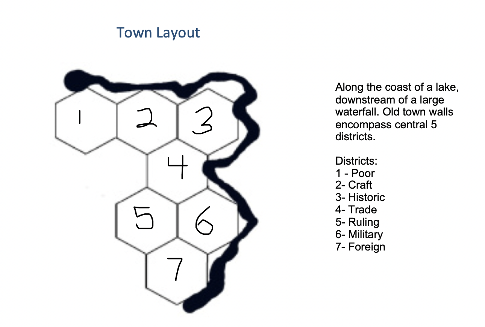

# Addermarch

Addermarch is among the wealthier and more prosperous of the southern tier of Wild Marches. It is largely rich agricultural land, supporting crops and especially fruit trees, which grow well especially in the higher elevations. Two major agricultural centers -- one in the upper river valley near Adderfell, the other in secondary river valley near Dunwick area. Also produce timber, others raw materials.

The southern portion of Addermarch stretches roughly from the [Greenwood] in the west to the eastern border of the March in the hills in a line running roughly parallel to the northern edge of Adderfell lake, and ends at the southern border of the March.

This land is mostly a rich agricultural area, with a focus on producing apples for the famous local apple brandy. Adderfell itself is a center of distilling and production, with barrels of finished product shipped downriver to markets in Sembara and the Inner Sea. The river valley is gentle, rolling hills (think Finger Lakes), with patches of forest among orchards and pastures.

The climate here is temperate, with warm summers and mild, wet winters, albeit with threats of snow in higher elevations [perhaps similar to e.g. interior Virginia]. The terrain generally slopes up away from the river valley, more steeply on the eastern side.

Settlement density is high within a few days walk of Adderfell, and remains high to the east (until stopped by increasingly poor land in the mountains), to the west (until stopped by the forest), and the north.

Towards the south, settlement density drops considerably towards the frontier, as danger of raiding and monsters from the Plaguelands becomes too high.

A line of keeps and defensive fortifications about a day's journey south of the last settlements provide protection for some scattered foresters, hunters, and trappers in this area, but settlement density is quite low.

Ambient Mood:

The area close to Adderfell is rich agricultural land, full of orchards, tiny villages, pastures, and people, although few are on the road these days. The land becomes sparsely populated towards the south.

The terrain climbs a bit and becomes rougher, and the danger of raids increases. The landscape shifts to match the current mood of the Addermarch: as travelers go south, abandoned farms are more common, people are scarcer and more suspicious, the chance of raiders increases, and raiders are bolder [attacking broad daylight at full strength, rather than in an ambush].

As farms and pastures disappear, the land becomes more forested, rolling hills, and potential for ambush and raiders increases dramatically. Settlements here are rare and rugged.

Traveling south on the main [Drankorian] road, two substantial ancient bridges cross the [river needs a name]. In between these is the last fortified town on the route south.

Beyond the second river crossing is officially "wild", and the east side of the river is pretty much "wild" too this far south.

Defenses:

The Earl of Addermarch maintains a series of defensive fortifications spaced roughly 15 miles apart in a line running east from the Darkwood. The area west of the Darkwood has no developed fortifications, but is loosely patrolled by Rangers. Darkwood Keep is the largest and most important defensive point, as it guards the low point and most passable zone into Addermarch (the hills get steeper and rougher to the east), and also provides some protection against whatever may come out of the Darkwood.

Settlements:

- In zone 1, there are frequent manors, farms, small villages, and minor market towns. Orchards and pastures are common sights from the road, and finding a farm house to spend the night is an easy proposition.
- In zone 2, settlements are rarer, and tend to be more heavily fortified. Landscape is more wooded, and more people eek out a living in forestry and trapping/hunting. Some agriculture exists but population density is much lower, and villages tend to be fortified. One substantial town exists, about a days' march north of the Keep.
- In zone 3, there used to be small populations of hunters, woodsfolk, and others living in low density, often supplying timber to the river to be sold downstream to Adderfell, or hunting and trapping for furs. But with danger increasing, these folk have almost all abandoned their homes and fled north

Ruins and Dungeons:

- The whole area is has a long history of setttlement, from the original people's [first Northerners] who lived lightly on the land in small villages with hill forts and stone circles marking points of weakness between this world and the faery realm, to the Drankorians who invaded north and settled and turned this into a rich agricultural land, to the Sembarans who have been living and building in this area for hundreds of years now.
- Ruined watchtowers and small forts dating to Drankorian times are not uncommon
- Stone circles and other signs of the old gods and the Faery realm are also not terribly uncommon
- The Rangers do maintain some small fortifications, usually hidden, that serve as forward bases and safe places to camp, especially in Zone 3
- Also in Zone 3, Cinder Court / Hobgoblin forward camps are present

# Adderfell

*Adderfell is set on the edge of a small lake, below a towering waterfall. The most striking feature of the town, besides the stone walls obviously kept in good repair, is a cliff rising from the edge of the lake with a keep on top of it. Outside the walls and below the keep on the lake shore, there is a stretch of reeds, willows, and cattails, among which you can see a glimpse of some wooden huts on raised piers. Along the walls as you approach, you can also see a number of wood and thatch buildings that have grown up near the town, many of which look pretty run down.*

## City Overview

Adderfell is an old city, and was richer and fancier back in the day when it was a center of trade between Sembara and Dunmar in the previous age; was ruined and has been partially resettled now. The region is known for cider and especially apply brandy, and Adderfel is one of the major routes by which they are transported downriver. The area was resettled because it is a natural port (beyond which navigation on the river is not possible) and central to the river valley. 

Adderfell a center of trade and commerce where products from the upland river valley (chiefly apple brandy and cider, but also timber and metal) are gathered and shipped downriver by three major competing local merchant houses (and many minor merchant families). It is built on the ruins of an older settlement, which shows in several ways. The old stone walls of the city, while they have been repaired many times, are truly ancient and it shows in the weathering of the stone and the precision of the craftsmanship. Occasionally throughout the town older stone has been reused in newer building, creating an interesting architecture effect. Most notable, however, is the large plaza paved with smooth white marble and featuring a large fountain in the center.

Rising above the bustle of the trading sectors of town is the Earl’s manor, perched on a rocky outcropping above the city. While three sides of the outcropping are shear cliffs, isolating the manor from the town below, on the western side (towards the walls) the slope, while steep, is scalable. Leading down from the manor is a switchback road carved into the side of the hill (also ancient), which passes through a series of barracks and meets the defensive fortifications of the main town gate. 

Outside the walls and below the manor cliff is a small swampy area of cattails and reeds. A small community of lizardfolk live here, mostly in small wooden huts built over the water. In the northwestern part of town, another settlement has grown up outside the wall, but this is a human community mostly of poorer peasants and folks who are laborers who have moved to town in the past generation or two as its wealth has increased. They live in small shacks along the sometimes swampy and damp lake, and outside the protection of the stone walls. 

Adderfell and the region surrounding it is best known for the local apple brandy, which colors a lot of their cuisine and customs. For example, a custom especially espoused by the locals who have lived in town for a while is to serve a glass of an apple cordial, sometimes poured over sharp apple or pear sorbet, both in between courses and as a dessert. The lizardfolk have also adapted apples in their cuisine, and are known for seafood dishes incorporating apples or apple brandy, including a lake fish with apples speciality and freshwater mussels with apple brandy. This “lizard cooking” has a loyal following among some (although not all) the humans in town.

These days, things are tense in Adderfell. Crime has increased and there are attacks and thefts at night by unknown assailants. Outside the walls people are barring their doors at night. The lizardfolk communities despite being normally open and welcoming have withdrawn and are closed to visitors, as is the ruling district/manor house. While the military/manor area is pretty safe, and the docks are heavily guarded as are the main warehouses of merchant families. However alleys and streets of the historic district are pretty dicey right now, and Cinder Court is clearly trying to create fear and unrest in the town.

Additional Notes and Details

Halflings and the Winter Market. Every year several groups of wandering halfling merchants and travelers come to spend the winter outside Adderfell. They usually arrive in late November, and stay through late February or March, selling trade goods and the like and spending the cooler and rainier parts of winter off the roads, which turn to mud. When the first traveling groups arrive, they set up a Winter Market on the outskirts of the Poor district along the lake, which is typically a big and exciting event, celebrated with feasts and performances (echoing e.g. winter solstice celebrations).

Conflict among the Brandy Houses. Several warehouses, distilleries, and cellars of merchant houses that produce the apple brandy the area is famous for are located in the northern part of town, inside the walls and adjacent to the old town and the docks. There are three major houses: House Caford, House Aedmor, House Rawley. They are usually in conflict with each other over land and money. Earl Eofric has not focused on the commercial aspects of his rule, happy to just take the money for a license and let them be, so the Houses are somewhat free to build their influence. However, the Cinder Court has been bad for business and at the moment the houses are united in their desire to deal with the problem (but are focused on a local solution). 

The old plaza. In the center of the old part of town is an ancient plaza, constructed of totally smooth, enormous paving stones with a magical fountain in the center that creates water for itself. This is a relic of the old city before the Blood Years and the Great Plague. It has become something of a central meeting point and heart of the town - many people get water from the fountain, and there is a daily morning market on the plaza, as well as high-status shops lining the streets. To the east towards the water is more run down and the plaza also mark the eastern edge of the fancier part of town. These days the area east of the plaza heading for the river is Cinder Court territory. 

Apples everywhere. The area has several local customs devoted to unique ways of cooking and drinking apples. In fancy meals, the locals serve a glass of an apple cordial, sometimes poured over sharp apple or pear sorbet, both in between courses and as a dessert. The custom is particularly popular / emphasized in the hustle and bustle of the docks, with small market stands offering a hot meat pie and a glass of a low-grade apple brandy for lunch, for example. The lizardfolk living outside of town have also adapted the local fondness for apples, but tend to prefer seafood, and so have developed a local cuisine around seafood and apples that is has a strong following in the town.

The cliff. The central feature of Adderfell visible from a distance is a striking cliff rising in the middle of town. The land generally slopes down in rolling hills dotted with orchards towards the lake, but here there is a remanent of harder stone jutting out of the landscape, upon which Earl Eofric’s manor is perched. Historically this was a sacred site, and so the manor house incorporates some ancient distinct stones from a runic circle here. On the east side of the cliff, the slope is slightly more gradual, and an ancient stone road has been carved into the side of the cliff, ascending in switchbacks to the top. This area also have barracks carved into the cliff wall. When the area was first resettled, it was as a military outpost, the military district and ruling district were built first and fortified. Later, the trade, craft, and historic districts grew up around them as the wealth in the area recovered. Finally the poor district sprawled outside the walls.

Other City Locations

Shops. Most shops are located in the trade area, up from the docks; or alternatively near the market plaza along the warrens of streets and small alleyways in this area. The exception is weapons and armor; there are a weaponsmith and an armorer in the military district near the bottom of the steep climb, adjacent to the trade area. There are also goods available at market in the old town, and two large food markets (each several times a week), one in the poor area outside the walls and the other in the trade district.

Old Town Market. Market has a variety of peddlers, tinkers, and merchants. Most simple goods are available, and some additional people. Simi the bookseller regularly spends mornings at the market; also Hanse the jeweler, a friend of Simi.

Temples. There are four temples in town: 

- The biggest, located in at the edge of the historical district, is dedicated to the eightfold gods as a whole, and is built in a the stereotypical octagon with alcoves in each wall. 
- In the Earl’s manor, there is a small temple dedicated to the Wildling
- In the docks district, there is a small shrine dedicated to the Traveler
- In the barracks, there is a small shrine dedicated to the Warlord
- There is also a new temple to the eightfold gods under construction in the craft district

Lizardfolk swamp. Lizardfolk are not welcoming to strangers at the moment, having closed off their community to outsiders in light of the ongoing dangers of the Cinder Court. If the PCs have a compelling reason to want to come here, can potentially attempt a skill check to be allowed in (can also attempt to sneak in), but would need a convincing reason.

Historical district. The most obvious feature is the huge plaza and fountain, but there is also an ancient tower that is the home of the Mistress of Letters (Lady someone), who is a reasonably accomplished wizard. She has two apprentice wizards that live with her; otherwise not much magic in town. Between plaza and lake is increasingly Cinder Court territory; main base of operations is out of an abandoned warehouse here.

# NPCS

Earl Eofric is a well-muscled man with chestnut brown hair, sharp features, and battle scars, most notably a broken nose that never healed properly, wearing a polished chain shirt under a well-made cloak. He is scowling at a guard when you come in, barking at him “We need more patrols inside the walls as well! Get it done!” He turns to you, frowning, and says: “Yes? I am told you have a letter from my man Oswyn?”

