## Inhabitants of Ausson’s Crossing

### The Ausson Household

The Ausson’s are the primary and most important people in the Last Inn, as the main landowners and principle force.

They are:

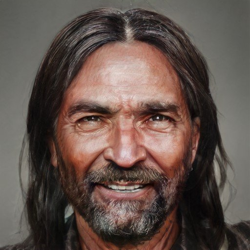
Roland Ausson (he/him), the innkeep. He was the leader of the settlement, the owner of the inn, and patriarch of the Ausson family. He was known to be absolutely devoted to his wife, Lisette, and his husband, Pierre, but was never a well-loved father to his four children. He grew the inn complex from a small single building to a settlement of almost a hundred, mostly through force of personality, and his wife Lisette’s trade acumen. He was found murdered in his bed 10 days ago.

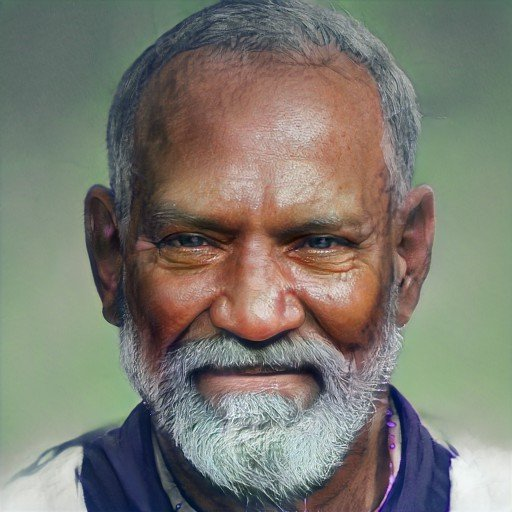
  
Pierre Ausson  (he/him), his husband.  He is the host of the settlement. Whereas Roland provided the raw energy, Lisette the trade and business acumen, Pierre is the one welcoming travelers at the door and making the inn a home. Like Lisette, he traces his ancestry to Insingue, but he has no longing for the past nor is he charmed by tales of the old cities. He craves simple comforts: good food, a warm hearth, loved ones. He has not left the private upper floors of the inn since Roland died although he has received a small number of well-wishers.

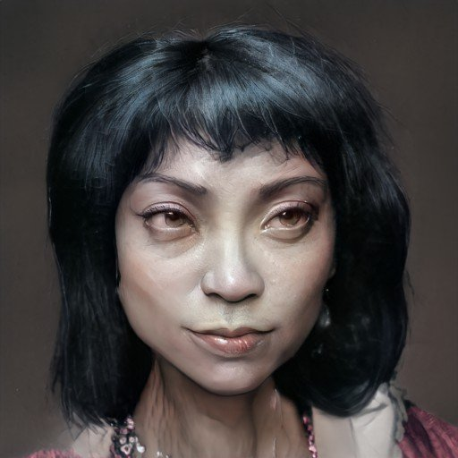

Lisette Ausson (she/her), his wife. She is the mother of four children, and a shrewd accountant and trader, she came from the Aurbez plateau and is not-so-secretly a partisan of political unity amongst the Aurbez peoples and regions. She traces her family back to the lost city of Insingue and is known to be susceptible to romantic tales of the past. She wears her heart on her sleeve, and is openly distraught about Roland’s death. She has forbid anyone live the settlement until his murder is solved and the murderer brought to justice.

Their children and in-laws:
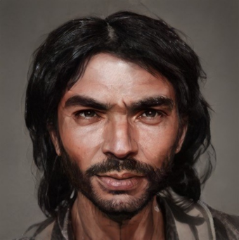
Bastien Ausson (he/him), the heir to the Last Inn. He s the eldest son of Lisette and Roland, and with his wife Annette, the heir to the inn and the one in line to take over for Roland. Bastien and Annette have six children who are often underfoot, and there are rumors around town that Bastien does not agree with his father’s stated desire to keep the settlement from growing any further.

Annette Ausson (she/her), Bastien’s wife and partner
Cedric Ausson (he/him), the second son and master of trade
Julia Ausson (she/her), Cedric’s wife
Gabriel Ausson (he/him), the third son, whereabouts unknown. Feared dead

Gisele Ausson (she/her), the youngest, a seamstress, weaver, and childminder. She is the youngest daughter of Lisette and Roland was recently widowed when the shaking fever gripped the town last winter. She is a seamstress, weaver, and cook, and clearly loves children. Her young son Pierre is her constant companion, and she is the teacher and surrogate mother for many of her nieces and nephew
Matthieu Ausson (he/him), Gisele’s husband, recently dead of the shaking fever

And grandchildren:
 

Vivien, daughter of Bastien and Annette (age 15)
Arnaud, son of Bastien and Annette (age 14)
Colin, son of Basiten and Annette (age 12)
Lisette, daughter of Basiten and Annette (age 11)
Roland, son of Basiten and Annette (age 9)
Colin, son of Bastien and Annette (age 4)
Anatole, son of Cedric and Julia (age 13)

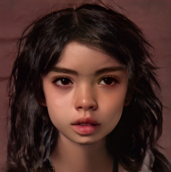
Morgane, daughter of Cedric and Julia (age 9)age 9, is one of Roland and Lisette’s many grandchildren. She is curious and inquisitive and has a bit of a mean streak.

Gabrielle, daughter of Cedirc and Julia (age 6)
Flora, daughter of Cedric and Julia (age 5)
Pierre, son of Gisele and Matthieu (age 2)
  

And the live-in servants:

Bruno Dumont (he/him), the barkeeper
Celeste Dumont (she/her), Bruno’s wife, the head housekeeper
Alain Dumont (he/him), age 20, a handyman and carpenter, restless with his lot in life

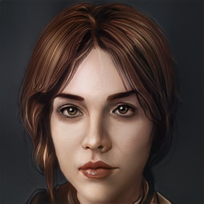
Eva Dumont (she/her), age 19, a housekeeper, content with her lot in life. She was a housekeeper at the inn. She was known as a bit of a flirt, sunny, and kind-hearted. She was found in the courtyard, by the main fountain, brutally murdered, 3 days ago. 

Lucien Istaborren (he/him), mid-20s, an orphan from the west, of unknown parentage, now a housekeeper and barman. 

Edmond Wode (he/him), late-20s, a refugee of uncertain past, from the north, perhaps Adderfell. Does not speak of his past. Now a housekeeper, handyman, and cook’s apprentice. Rarely seen in public. 

The cook (she/her), her wife (she/her), her mother (she/her), her sister (she/her), and her daughter (she/her) live in a nearby cottage.

The groom (he/him), his wife (she/her), and mother-in-law (she/her) live in a nearby cottage.

### The Artisan Households

The town is blessed with a miller, a baker, a brewer, a blacksmith and a temple steward, each with their own household.

#### The Blacksmith

Vistra Fireforge (she/her), dwarven blacksmith. She is a young and talented dwarven blacksmith. She owns the forge in town and lives in the large house next door with her two human apprentices, Felix and Andre, and a scullery maid. She serves as the Aussons master of metal trade and often makes deals with caravans on their behalf. She is bright and open but also reserved and is known about town as something of a closed book.

Felix (he/him), age 21, her lazy human apprentice. He is an apprentice blacksmith, and is not very dedicated to his work, but is a cheery, charming, well-liked young man of 20. He is clearly one of those people who can slide through life on his charm and good nature, a little dumb, a little lazy, but fundamentally kind and willing to work hard just often enough to stay in (most) people’s good graces.

Andre (he/him), age 23, her hard-working human apprentice
Caitrin (she/her), age 40, the scullery maid, from Tyrwingha

#### The Brewer

Estelle (she/her), the brewer, died last winter in the shaking fever
Jean (he/him), age 25, Estelle’s apprentice, recently arrived in town, now the brewer
Aalis (she/her), Jean’s wife, died last winter in the shaking fever
Piers (he/him), Estelle’s father. He was a friend of Roland’s father and has been brewing beer and ale in Aussons Crossing for many many years. He is now retired. His son died of the shaking fever last winter and he has not been the same since.

Jean’s children, ages 4 and 6

#### The Temple

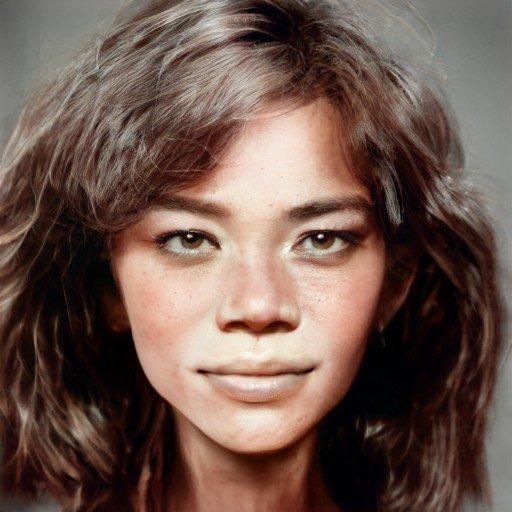
Ysabel Queval (she/her), middle aged, the temple steward. She is a stickler for rules and rites and ceremonies and at times comes across as a petty bureaucrat, seen to use her position administering the temple to her own benefit. Few in the town truly like her, but she is given grudging respect as she is very good at her job.

Lorin (he/him), her young assistant, rumored to be having an affair with Ysabel

Simone (she/her), Lorin’s wife and the embalmer

#### The Miller and the Baker

These households are unnamed and background. The miller lives with his wife, their three young kids, and an apprentice/servant. The baker lives with his son and their two servants/apprentices.

### The Ranchers

On the north end of town are two large ranch-houses, encouraged by the Aussons to provide a more robust food supply. They mostly ranch goats and grow garden vegetables. They are known for their summer melon.

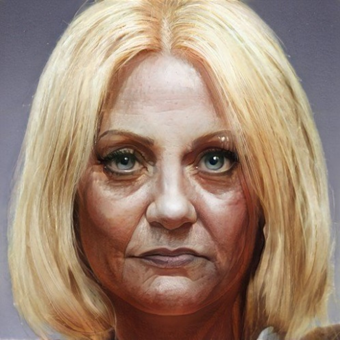
Annais Chavert (she/her), an elderly woman, and matriarch. She is a rancher and matriarch of her large family. She has lived in the settlement since she was a girl, and is very fond of Roland. She has a way with goats, and it is said she can bewitch water from the ground – or at least find it more easily than most. Her husband, Cardin, cannot walk, and she runs the ranch with her two daughters, Cardina and Annais, son-in-law Hugo, and four grandchildren.

Cardin Chavert (he/him), crippled, Annais’ husband
Cardina Chavert (she/her), the daughter of Annais and Cardin
Annais Chavert (she/her), the daughter of Annais and Cardin
Hugo Chavert (he/him), the husband of Cardina
  
Cardina and Hugo’s four children, aged 13, 12, 11, and 7  

Bartholomew de Semb (he/him), a refugee from Sembara seeking a homestead
Maud de Semb (she/her), Bartholomew’s wife
Bertran, a ranch hand hired by Bartholomew and Maud in Maseau  

Estienne, a young man from the Aurbez, courting Annais the Younger and working on the ranch

### The Barracks and Laborers

The settlement is on a frontier, and the Aussons make it a point to hire some guards and laborers to help out with the ranching, defend the settlement, help with caravans that come through, and so on. Most of these people live in a large cottage set back from the inn.

  
Jean (he/him), the eldest guard, known as “the Elder”
Mortimer (he/him), another guard
Jacques (he/him), Mortimer’s brother, known as “the Strong”
Henri (he/him), a widower, and his teenage son
Tomas (he/him), who abandoned a farmstead to the south, and now works as a ranch hand
Suzette (she/her), Tomas’ wife

### Others

There are two solitary men in the town who don’t fit very well into any category.
  
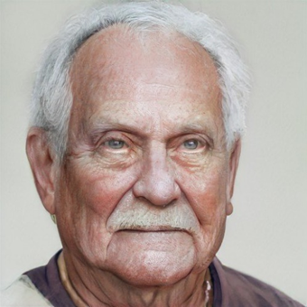
Hugo (he/him), known as “the Elder”, an eldery man who lives on charity. He lives in a ramshackle hut on the charity of the others in the village. He is cranky and often complains and has few allies in the village, but the Ausson family has always been willing to ensure he has enough to eat and a dry roof.

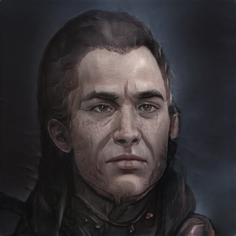
Nicholas, known as “the Clerk”, an agent for the Maseau caravans, minor magic user. He is a solitary man who works as an agent for a number of Maseau traders. He is not a factor, and does not trade himself, but he keeps up to date on the caravans that are due, helps them, and speaks on behalf of Maseau in town politics. He is a tinkerer and inventor at times, and knows a few minor spells. His greatest claim to fame is when he purified a large amount of spoiled grain. He also mends broken things with his magic.

## Guests and Travelers

Of course, many of the people in the settlement are passing through:

### Guests at the Inn

When the adventure begins, there are six guests staying at the inn. None of them have been able to leave since the murders, due to Lisette’s insistence.

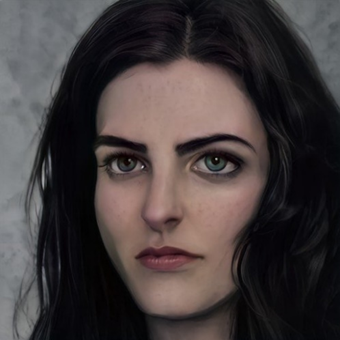
Canela Drusus (she/her), an and explorer and adventurer from Chardon, resting in the inn after a long journey, but getting anxious to leave.

Samso (he/hm), a lizardfolk, searching for kin in the fells to the south
Itzal (he/him), Samso’s brother

Johanne (she/her), so-called, an amnesiac who came to town with no memories, her real name is Roshan, and she is a young monk of Bhishma who has traveled north along the Dunmar road for mysterious reasons  

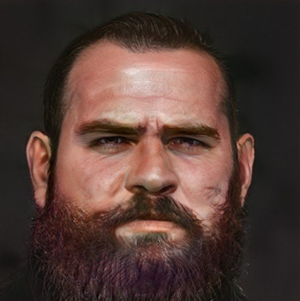
Darrak Deepmine (he/him), an ambitious young dwarf, recruiting assistants to help him recover lost treasure in the mines

Roe DoTorka, a cranky old dwarf who lives up in the plateau above Ausson’s Crossing. You are not close to him, but last winter you and he worked together to destroy an ashen element that had come out of the Plaguelands in an ash storm, came alive, and threatened to consume Ausson’s Crossing. He turned into beasts a lot and was not always pleasant to be around, but he was a good comrade and ally and was grudgingly respectful of you after the adventure together.

### The Halfling Caravan

A caravan of halflings from Chardon, bound for Embry in Sembara has been staying here for the last few days. Mostly keeping to themselves, the caravan has four wagons, a dozen horses, and the following halflings:

Bree Charmheart (she/her), the trademaster and spokesperson
Cora Charmheart (she/her), an elderly woman, often seen in the Inn common room
Anders Charmheart (he/him), the quartermaster and cook  

There are a dozen other halflings including several children, who have mostly kept to the wagons. They are carrying clockwork, stained glass, fireworks, intricate toys, and fine cloth from Chardon, and have some elaborate systems in the wagons to protect the goods in transit.
### The Maseau Caravan

A caravan of traders from Maseau, they are annual visitors to the Last Inn, trading grain, cheese, and dried meat for metal and goat hides.

The caravan has three wagons and eight drivers and guards, plus:  

Katherine de Abnas (she/her), the metalsmith and trademaster
Robert Poret (he/him), the caravan master
Geneve the Young (she/her), a hanger on and camp follower with no clear purpose

### The Departed Caravan

A caravan of traders from Maseau, although they had never visited this region before. They departed Aussons Crossing some time ago.
  

The caravan was trading grain and young goats for metal, and had two wagons plus a small herd of goats. In addition to the four anonymous drivers and guards, and three herders, the caravan had:
  
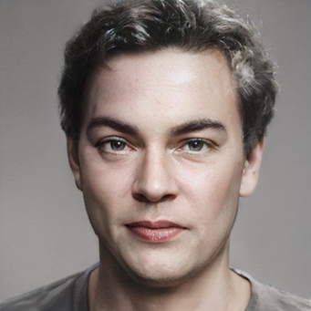
Gilles Festu (he/im), a charming storytelling and caravan master

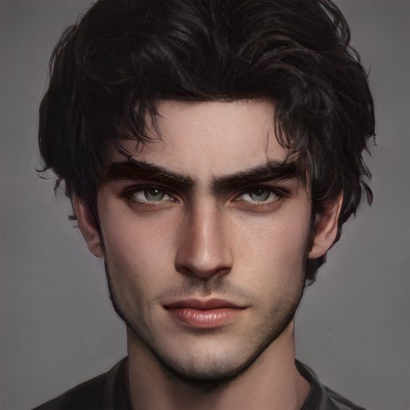

Tomas (he/him), a guard, now dead, found murdered 14 days ago

Dominic (he/him), a guard, now dead, found murdered 14 days ago

### Timeline of Events

April 20th

Joanne encounters Darrek Deepmine in the upper reaches of the Aursen, and has a conversation with him about going to the mines. She refuses to accompany him.
 

April 21st
Darrek Deepmine is possessed by the Goddess of the End underneath the mountains.
 

April 23rd
Darrek finds Joanne and steals her memories.

April 24th
Joanne comes to town, completely at a loss as to her background or who she is.
  

April 28th

Darrek Deepmine comes to town, talking about hiring or gathering people to investigate a dwarven ruin and find family artifacts. The same afternoon Gilles’ caravan comes to town.

April 30th

Vistra Fireforge is charmed by Gilles and convinced to give him an unreasonably good deal on some recently recovered dwarven steel.

May 1st

In the afternoon, Gilles announces his intention of leaving town.

In the evening, Vistra Fireforge confronts Dominic and Tomas about Gilles’ charm and demands to see him. They don’t allow it but there is a heated argument. Felix, returning from a secret liaison with Eva, sees this.

May 2nd

Just after midnight: Dominic and Tomas are murdered.
In the early morning, Gilles leaves without Dominic and Tomas

May 6th
Roland is murdered at night. 

May 8th
The Hafling caravan comes to town

  
May 12th
Eva is murdered at night

May 14th
The Maseau caravan comes to town
Canela comes to town

May 15th
Itzal and Samso come to town

May 16th
Roland’s funeral rites; the adventure begins

May 17th
Around midnight the PCs are attacked