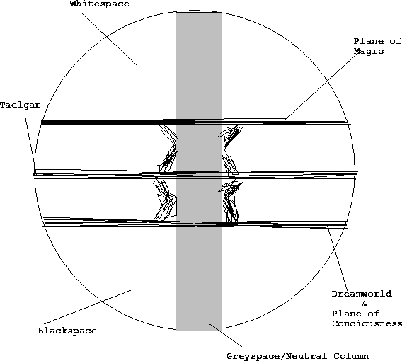

History, Religion, Politics, Magic, Races, Geography,  and General Information 
103 Fourth Age 

Edited and complied by Mike Sackton 
Material by Tim Sackton, Mike Sackton, Eric Rosenbaum, Dave Schwartz, and Dave Kong 

Note on factuality: I am composing this guide to be the truth about Taelgar. However, notes about what various people know should be included. 
Note on names: The following names should really be changed:  Melkor

General Information: 

Really Basic Stuff: 

Taelgar is a large world. The “known” world is primarily temperate.  The world itself is probably twice the size of Earth. There is one moon, proportionally the same size as the Earth’s moon. Taelgar does not exist in a solar system per se.  There is only the one planet, and the one moon. Beyond the moon is the sphere of fixed stars, which do change as Taelgar rotates.  The Sun is a star, around which Taelgar orbits.   

Calendar: 

The Taelgarian calendar is very similar to the modern day calendar, with the following changes: 

(Note: This is the human calendar. Halflings use it, but all the other races have different methods of keeping time, and only use the human calendar when necessary for clarity) 

January, February, March, April, May, June, July, August, September, October, November, December are the 12 months. 

Every 7 days is a week, the days of the week being Monday, Tuesday, Wednesday, Thursday, Friday,  Saturday, Highday. 

The following five feastdays are outside of any month: 

Midsummer- between the 30th of June and the 1st of July. 

Yule- 3 days between the 30th of December and the 1st of January 

[Samhain]- between the 30th of October and the 1st of November 

Every 4 years is a leap year, during which a day is added between Midsummer and the 1st of July. 

The years are currently reckoned from the end of the third age. In Sembara, Sembarin reckoning is still used (years since the founding of Sembara), and in Dunmar years are reckoned since the return of the King’s Horse.  The 3rd Age ended in 621 Sembarin reckoning, or 1257 since the end of the Second Age.   

The current date is: 153 F.A.,  774 S.R., 79 R.H. 

Religion: 

“In the beginning, there was a void.  Two brothers, Eru and Melkor dwelt there for time uncounted, exploring and growing in power”  –Human Creation Myth 

Cosmology: 

The void has three distinct parts.  First, the nullspace, a realm of literally nothing.  It is the symbolic and  metaphysical center of the universe.  Second, the truespace, or the realm of power.  From here, the entities drew all their magical energies.  This realm is also known as the plane of magic. Third, the greyspace, a realm of thought.  This realm is the pinnacle of the various planes of consciousness. It is here that we go when we experience particularly vivid dreams.  In that void, the elements of which still exist today, these twin entities created three other, distinct spaces.  First, and most important, is primespace.  This is the realm on which Taelgar exists.  Here, things work the way they are expected to.  Second is whitespace.  This is Eru's personal domain.  It is to Eru what primespace is to us.  Finally, the third space created is blackspace.  This is similar to whitespace, but it is Melkor's personal domain instead of Eru's.   

The existence of an afterlife depends upon race.  The elves are the only ones with a definite, and permanent afterlife.  When elves die, if they are given a proper burial within a set time, they go live with Eru forever, in the whitespace.  If they are not, their spirit is loose, and may either dissipate, or stay tied to the earth forever.  Dwarves and Ogres do not retain their consciousness after they die, but they do have an afterlife of sorts.  Their souls merge with the mountains.  In certain holy spots, you can almost feel the accumulated wisdom of thousands of years radiating from them.  Like dwarves and ogres, the lizard men do not retain their consciousness, but they do become one with nature.  The reason lizard men are such good healers is because they can draw on the spirit-force of their ancestors.  When humans and halflings races die, it is over.  They are gone forever. 

Some notes on resurrection:  

There are three ways to be resurrected: very powerful healing magics within minutes of death, divine intervention, or powerful ancient relics.  The most commonly documented form of divine intervention is the healing of a holy person’s son/daughter/wife/husband by bringing the body to a temple, after long days of prayer and purification, and begging Eru to help.  This happens nine, possibly ten times (one time it is not clear if the girl is dead or just almost dead) in the Scrolls of the Divine.  

The second form of divine intervention is much rarer, and the focus of a lot more study.  Twice in the Scrolls, a saint dies, his body vanishes, and within a week he reappears, alive, and generally much wiser.  The two people this happened to, Darian and Mordan, are major characters in the Scrolls.   

Theology: 

There are only two true gods of Taelgar, Eru and Melkor.  They are worshipped in various forms and incarnations in all cultures, among all races.  In addition to the true gods, there are many divine “aspects.”  Aspects can be best thought of as distinct personalities of Eru, Melkor, or some combination of the two. Most are rarely worshipped, but a few have obtained some degree of popularity among certain circles.  Despite the fact that all races and cultures worship the same gods, they all have their own versions of the cosmology of Taelgar, none of which quite match what really happened.  

Eru and Melkor are responsible for maintaining the balance between good and evil, death and life that exists on Taelgar.  They are the ones that hold the fabric of Taelgar together. They will not get involved in the concerns of Taelgar.  If one of them got involved, the balance they believe so strongly in would be completely disrupted.  Therefore, they will not act to help or hinder anyone or anything on Taelgar.   

Although there are very few churches to particular aspects, when one worships Eru or Melkor, one is not really worshiping a particular deity.  One is actually worshiping the particular aspect that most suites ones needs and desires.  A seaman therefore will actually worship the aspect of Oceans, although he prays to Eru, and a gambler might actually worship the aspect of Luck, though he prays to Eru.  These aspects are the are the only way Eru and Melkor can influence the world of Taelgar.  A few of these aspects have managed to gain a following in there own right. These aspects consist of combination of parts of Eru and Melkor, and are constantly in flux, depending on worshippers on Taelgar.  Some of the more important aspects include, Mielikkie, the aspect of nature, Demeter, the aspect of the earth, of fertility, and of harvest, Dyra, the aspect of luck, Ulmo, the aspect of the oceans, of travelers, and of weather, and Ares, the aspect of war. Furthermore, several of the races, including kenku [what else? This section needs work] have specific aspects that that race tends to worship. Vorshitaal, the aspect of thieves fills this role for kenku [other races?]. 

Despite the fact that one cannot actually worship Eru or Melkor, most people do.  The common population does not understand or know about the aspects of Eru and Melkor that are not distinctly deified. 

Eru and Melkor: 

Origins: Eru and Melkor are brothers.  They are finite deities, representing creation and destruction respectively.  They were there before Taelgar existed, when there was nothing save the void. Where they originally came from is not known by any humanoid culture on Taelgar.  They came from a precursor civilization that had evolved to a transcendent state, and was moving on to other realities.  They left the brothers in charge of this dimension.   

Attributes:  Eru and Melkor resemble archetype deities, with Eru representing creation and Melkor representing destruction.  However, they are much more than that.  They are complex beings with complex, often incomprehensible personalities and motives.  Together they form the balance of the universe; the necessary conflict between life and death, between creation and destruction, between good and evil.   

Power:  Eru and Melkor have vast power, but they are neither omnipotent nor omniscient.  Directly, they have no physical power in realms other than their personal domains.  However, acting through avatars and aspects they can wield great influence.  For the most part, they do not use it though.  Only in extreme circumstances will either Melkor or Eru actively take a hand in the daily happenings in Taelgar.  To do so would violate the inherent balance of the universe, and in extreme circumstances could threaten its very existence.   

Physical Form:  These gods have no physical form, as trying to view there incredible complexity and power is not possible for the mortal mind.  Their aspects and avatars, however, have varying physical forms based on their personal natures.   

Domiciles: Eru and Melkor exist solely in their personal realms, whitespace and blackspace respectively.  However, to enter the domain of a god is to give up any ability to return to the mortal world, in almost all cases.  

Immortality and Death:  Eru and Melkor are essentially immortal – they will die only when the fabric of the multiverse is unraveled.  Their fate and the fate of the rest of existence are inevitably linked and cannot be separated. 

Eru’s holy symbols are: a circle with a cross in the middle, or sometimes a plain circle, or sometimes a circle with a cross in the middle, but the ends of the cross stick out a little bit.  Very occasionally a stylized serpent swallowing it's tail 

Melkor’s holy symbols are: a circle with an upside-down triangle inside 

“Think of it like this: Eru is not a real God, in the sense most people think of Him.  He is, rather, a manifestation of the good and pure traits of life: companionship, charity, love, even things like lust and mischief.  That He is also the creator of these traits is not particularly relevant.  If all these traits ceased to exist, so would He.  Then again, if he ceased to exist, so would all these traits.  It is a symbiotic relationship of sorts.   

Melkor, on the other hand, is a manifestation of all that is tainted and corrupt.  He turns lust into lechery, mischief into petty cruelty, love into hate, and charity into greedy selfishness.  Now, we all have a little of both Gods in us; I would like to think we have more Eru than Melkor, however.” 

(From Lecture XI: The Nature of the Divine, by Larius, a First Great Empire scholar) 

Aspects: 

[this section needs work—what should be said about each aspect? All I currently have are holy symbols and spheres of influence] 

Mielikkie: the aspect of nature, wilderness, wild animals 

Freya, the aspect of the earth, of fertility, and of harvest  

Dyra, the aspect of luck 

Ulmo, the aspect of the oceans, of travelers, and of weather 

Ragnor, the aspect of war.  

Raniera, the aspect of love 

Vorshitaal, the aspect of thieves, also the specific aspect of kenku 

There are other aspects then these, in particular, there are evil cults worshipping aspects of Melkor other than the ones above.  

Mielikkie: a crescent moon, a stylized tree (trunk and two branches), or a deer's antlers 

Freya: crossed wheat stalks 

Dyra: coin with Eru’s symbol (a circle with a cross in it) on one side and Melkor’s symbol (a circle with a triangle in it) on the other 

Ulmo: breaking wave, thundercloud 

Ragnor: stylized sword 

Raniera: clasped hands, heart 

Vorshitaal: a stylized talon, stylized dagger 

Creation: 

[the real version, not the human version should be detailed, as should specific racial versions] 

The human creation myth: 

In the beginning, there was a void.  Two brothers, Eru and Melkor dwelt there for time uncounted, exploring and growing in power.  Eventually, they discovered a new power, a power of the binding and unbinding of reality.  Drawing from the center of this power, they discovered how to create, and destroy.   

Eru, in his eagerness to grow, began to create, and what he made was beautiful.  Melkor saw what his brother was doing, and was jealous of his brother’s creativity.  But when he tried himself, he found that he could create nothing of beauty, being tainted by jealousy for his brother.  In that instant, he decided his brother was a better person than he was, and so what could he do but be evil?  All of Eru’s offers of reconciliation fell on deaf ears.   

In time, Eru grew in his strength, and became daring.  Mustering all his power and courage, he began to sing, and with his song the earth was born.  It was given the name Taelgar.  Deciding that his creation needed a people to give it life and color, he created the elves.  He made them friends with the trees and the flowers, the birds and the fish, even the lowly insects.  But nothing could escape Melkor’s influence; especially not something created by his truest brother.  So the elves became aloof and distrustful of the outside world.   

After having created a people to populate the world, and finding them only living in the forests, Eru decided he must create more.  From the stone of the highest mountains, the chill air and snow, he molded the ogre, strong and brave and wise.  Yet they too were caught by Melkor, and made to love their mountains too much.  Rarely, if ever, did the ogre come down from their lofty peaks to grace the world of man. 

So Eru created another race, a race dwelling under the mountains.  If civilization could not flourish throughout the land, why not in the mountains?  The dwarves were made from the roots of the earth, stoic and enduring.  The dwarves, finally, were a race that could develop a great civilization, albeit under the mountains.  They were numerous and prosperous, honorable and courageous.  Yet even they could not escape Melkor’s evil.  He made them too honorable, so honorable that the race was sundered.  Over half the race, including a disproportionate number of females, left because they could not accept inter-dwarven war.  As far as anyone knows, they all disappeared.  Ironically, soon after that the dwarves established themselves as one kingdom under a high king. 

After the dwarves, who were made in the same mold as the elves and ogre failed to spread throughout Taelgar, Eru began experimenting with other races.  He created the lizard men, a peaceful race of healers, hoping they could civilize the world.  But they lacked the ambition and drive to expand.  He created the halflings, making them curious enough to travel, but Melkor twisted it the other direction, so they ended up with no homeland, and no desire to settle down, and so took to the seas. 

Finally, Eru created the humans.  They were different from all the races that had come before.  They were far more diverse and adaptable.  They were shorter lived, but more ambitious and daring than the previous races.  However, they were not as pure.  As they began to grow and spread, their impurity began to show.  Some humans were not friendly, they were jealous.  Some were humble, but just as many were arrogant.  But in their adaptability, they prospered, and became the race of Taelgar. 

The Church: 

The organized priesthood is very small.  Since most people do tend to worship at home, only going to 

temple when they need solace or on important holidays, there is no need for lots of priests to 

"tend the flock," so to speak.  Therefore the only people who are allowed into the priesthood are those that have the spark, i.e., can channel divine magic.  This makes the priesthood extremely small, and virtually uncorrupt.  And the priests tend to be spread out over a great distance, one or two tending each temple, a few more in the really major ones (Chardon, Marsember, etc).  Since there isn't really a big organized Church, the political power of the priests tends to be small.  However, everyone listens to them, and they can wield great influence if necessary.  

Common ways of worship: Simple prayers before meals or at other appropriate times (“We thank Eru (or thank the Creator) for our food, our wine, our health, etc. Amen”), wearing a holy symbol, often Eru (or an aspect) is invoked in times of need. 

There is one major religious document, the Scrolls of the Divine.  It was passed down through oral tradition until the Second Age, when a priest on Hkar transcribed it, and some new material was added.  It is available in every temple and most people at some point or another reads sections of it, although for the most part the only people who read the whole thing are priests and scholars.   

Some selections from the Scrolls: 

. . .And when Eru spake thus, the heavens opened, letting the white light of heaven shine through the land, and sickness vanished, famine ceased, and even death paused in its path, for the light of Eru could heal even the dead. . . 

. . .Darian approached, carrying the body of his dead son.  And the doors of the temple swung open, from no earthly impetus, and the columns gleamed with a blinding white light, as if heaven in all its glory had taken up residence in the temple.  Darian was drawn forward, and lo!  When the light died, and he could see again, his son was standing, the light of Eru pulsing in him. . . 

. . .And so Eru spoke, saying thus: “You shall venerate me always, but never pretentiously, for the glory of my name is not to be found in gold and jewels, but in a pure heart. 

And Mordan spoke to the people, saying: “I have been where no man lived, and seen the very heart of His glory, and it is not a place of material wealth.  But oh, the riches there!  You have never been as content and relaxed as I in that place.  So let the word go forth, and let the name of Eru grow in us!”. . . 

. . .The old man, grieving for his lost son, wailed, “But why can we not stay there?  Should we not get as good a fate as the elves?” 

And Mordan replied thusly:  “If we were to dwell forever in Eru’s domain, spend eternity in His bosom, we would grow weary of existence, and wish to end it.  Ours are short, fiery, but quick lives, and we must accept that.”. . . 

[more selections and some commentary should be added] 

Holidays: 

[needs much work] 

Several Religious holidays exist: 

They are celebrated in all the human kingdoms, although the traditions might be different (the methods listed are for Chardon). 

Mordan’s Day: April 3. The Day when Mordan returned from the dead.  Tends to be celebrated by enforced day of rest, and religious readings during the day, and a feast at night, featuring eggs, lamb, and fresh greens. 

Day of the Dead: November 6: The day during which the dead walk again (not literally, but…). Similar to the ancient Halloween. A time from lighting bonfires, staying at home, and telling stories of ancestors. 

Daarest: September 9: This day is for fasting, mediation, and seeking of forgiveness.  A day for cleansing of sin, and for repairing of lost relationships and finding of old friends.  A day to be compassionate to strangers. 

Religious holidays tend to be based on the details of religious history, of  

which very little exists.  In the few fragments of the Scrolls of  

the Divine that you did write, there are two major figures, Darian  

and Mordan.  Mordan was resurrected. What about some sort of Easter  

holiday based around that? Or maybe a holiday based around one (or  

both) of there birthdays.  What about an awakening day, the day on  

which humanity supposedly awakened. Day of the Dead?  

History: 

Prehistory: 

Vorshitaal creates the kenku. Dragons exist. Time does not. 

First Age: 

The Eldar Days. The time of the Elves. Cataclysmic wars end the Age and change the face of the continent. Pythus (a dragon) is killed at the end of the age. 

Second Age: 

Hkar. Great Dwarven Empires. Huge underground tunnel systems are built beneath the Khazad Mountains. The Dwarf-Orc wars end the Age and decimate the dwarves, causing many of the once light caverns to fall silent. Runic Magic is lost at the end of the Age, and Hkar sinks. 

Third Age: 

First Great Empire, ruled by Darius, is destroyed by the Plague of Cha’Mutte.  The Age ends with the reemergence of the Plague, and Cha’Mutte attempting to destroy the Firstborn of all the races.   

Fourth Age: 

The 4th Age began in chaos. Some of the more important events of the early fourth age. 

(Current date: 103 F.A.) 

1 F.A. With Cha'mutte's death, the plague begins to spread again.  However, there is nothing keeping it from being dispersed by the wind.  (Cha’Mutte had his limits, after all.  It was more important to 

him to use the plague as a barrier between Rohan and Sembia than to kill lots of people with it, so he expanded it to the largest size he could hold stable, and then stopped.)  After spreading in all directions for several weeks, it slowly begins to disperse.  It spreads into southern Sembia and eastern Rohan before beginning to blow away.  Both countries suffer heavy losses, although Rohan suffers more.  General panic ensues in Rohan.  By the middle of the first year after Cha'mutte's death, the plague has blown 

west, decimated Turmish and also further cutting off the north from the south, as all the existing trade stops are destroyed.  The Turmish government completely collapses.  Rohan can only maintain order west of the 

river.  The capital is relocated.  The plague, fortunately, missed Marsember, but barely.  Much of the population flees to the northern strongholds.   

Also in this year, the hobgoblins that survived begin to attempt to spread in all directions.  The dwarves and ogre, outnumbered perhaps 15 to 1, fight a prolonged retreat over the course of several months, finally arriving back in the mountains exhausted, and suffering greatly.  The elves also fight a prolonged retreat, outnumbered maybe 50 to 1, although this doesn't bother them so much.  Many elves die, however, further reducing the population, almost below sustainable levels.   

1 – 5 F.A.  A side effect of the dispersal of the plague is toxic rain, as it gets into the upper atmosphere. Sporadic deaths, and a great deal of property destruction occurs. 

3 F.A. A message was received from the elves saying  “We are in dire trouble.  Send aid.”  Unfortunately, no one was in any shape to send aid.   

6 F.A Rohan and Sembia build a new road, avoiding the remains of Irebor.  The roadway from the South is connected to this new road. Trade begins to move along it, and the small village of Alcar begins to grow. 

1 – 52 F.A. The Hobgoblin Wars.  The number of hobgoblins and other nasties in the north was greatly underestimated by all.  Cha’Mutte had kept huge reserves in the other dimension, whom he had magically altered to be plague resistant.  The plan was to drop them in the plague on the borders of Sembia and Rohan as soon as the massive armies sent north by the "good guys" had been destroyed.  He died before he could do that.  After several days of not getting the "go-ahead" order, the hobgoblins decided to leave. 

Perhaps 500,000 hungry, desperate hobgoblins, wanting territory for themselves, began fighting their way south.  For fifty years, wars raged across the north, fought primarily by Chardonians and those in the Rohirrim and Sembian armies who, because of the plague, no longer had families to go home to.  The kenku also played a major role in these battles.  However, the plague circulating in the upper atmosphere caused many problems for the kenku—many died before the cause was figured out.  Eventually, at great 

cost, the hobgoblins were reduced in number sufficiently so they could not put up a fight.  They fled to the foothills of the mountains, some settling the northern areas of what used to be Volkraad, others settling in Pandar,  or south along the mountains.  Everything north of Chardon is effectively abandoned to the wilderness.  

10 – 12 F.A. Kenku begin to establish Vasa as their homeland (primarily Vasa, since Volkraad is still overrun by hobgoblins).  The do not spread far from the mountains, however. 

1 – 20 F.A. Chardon sends exploratory vessels northward, finding only wreckage where the country of Amn used to be.  No attempt to resettle is made. 

26 F.A. Current king of Rohan dies.  The new horse is born, but, in an unprecedented move, does not pick a king.  Instead, rides north and west, towards the area of Rohan that has been abandoned the longest.  Rohan sinks further into chaos.  Effectively stops existing as a country. 

33 F.A. Derik III lives to the ripe old age of 74, and later becomes known as one of the great kings of Sembia.  Revin I takes the throne. 

54 F.A. New Volkraad is founded not far north from the Lizard man swamp.  King Ranth vows to reclaim his country from the hobgoblins. 

66 F.A.  With the wars over, Chardon begins to grow.  It sends exploratory vessels southward, but they never return. 

74 F.A. The horse of Rohan returns, rode by a young King.  He begins to gather people, and rebuild his country.  Eventually becomes known as one of the greatest kings of Rohan ever. 

79 F.A. Several frontier outposts established north of New Volkraad. Heavy raiding from hobgoblins is experience.  King Ranth manages to hold the frontier, but at a cost.  Several of the outposts are abandoned, and the others are reinforced. 

Politics: 

The important city-states, countries, and organizations of the 4th Age are as follows: 

Chardon:  

Chardon is a major country, containing 3 million people, of which probably 80,000 live in Chardon City itself, and another 200,000 live within a day’s ride. A center of trade and knowledge.  It is run by a Council headed by an elected Mayor.  The Council is divided into the lower Council, consisting of between 50-100 elected officials, and the upper Council, consisting of 10 members selected by the Mayor.  The lowe Council has very little power.  Chardon has a relatively significant navy, and it’s standing army has been drastically enlarged over the past 50 years.  One of the most important features of Chardon is Mt. Chardon, an extinct volcano.  One side of Mt. Chardon is sheer, and looks like black glass.  It is completely smoth and straight.   

Sembia: 

Sembia is another major country, and although the recent hobgoblin wars and current problems with babarians and pirates have weakened it, it is still perhaps the most important and powerful country in Taelgar.  Currently relations with the dwarves and Rohan are very good, as are relations with Chardon. Some tension exists between Sembia and the kenku, but this is mostly due to the fact that Derik III and his son both felt personally thankful to the kenku for all they did during the hobgoblin wars and the Great War.  Marik tends to treat the kenku as just another country to be dealt with, and for this first time in almost 50 years, the Northern Wall has patrols, although light ones. Sembia is ruled by a constitutional monarchy, which is composed of the King and a Baron’s Court, which is composed of the Barons and Dukes of various cities within Sembia.  The capital of Sembia is Marsember. Some of the more important duchies include the Duchy of Procampur, the Duchy of Marsember, and the Duchy of Telmare. 

Rohan: 

Rohan suffered devastating losses in the Great War and the subsequent Plague years.  Without a king for 48 years, they fell into chaos and substance farmers and horse herders.  Little in the way of rebuilding was done, as every family made do with what was at hand.  The cities of the Rohirrim emptied, and are only now beginning to be rebuild.  Furthermore, the once magnificent army crumbled, and, although reborn, is not what it used to be.  Hobgoblin and kobold raids from the southern edge of the mountains occur considerably more often then they should.  Rohan is ruled by an absolute monarch, picked by some supernatural means, perhaps having to do with the spear of the king, or the horse of the Rohirrim.  Rohan is the bread basket of Taelgar, and tends to export large amounts of grain.   

New Volkraad:  

New Volkraad has had a rather unfortunate time.  Although New Volkraad City was built without difficulty, expansion into further areas northward are being met with resistance by various hobgoblin tribes.  King Ranth is aging, but still hale, and he intends to recover more of Volkraad’s old territory before he dies. 

Alcar: 

This city was founded near to the site of Irebor, but far enough away to avoid the supposed curse upon that city.  It is still relatively small, but recent dwarven trade is lending to its importance.  It is an oligarchy, ruled by representatives from the major merchant houses of the area.  Since it is outside any current country, many merchant houses base themselves here to avoid taxes and other regulations of established countries.  It has the feel of some combination between a trade town and a frontier town. 

Other: 

Several other organizations exist of some importance.  The most important is probably the Rangers, a general force for peace and restoration in the Sembian area.  The Chardon Academy can also weild significant political clout when necessary. 

Races: 

Elves: 

 The elves are by far the most noble, powerful, and aloof of all the races. They are very isolationist, dwelling far to the north in a large forest. Their powers are legendary: they are described as being able to shoot down a bird at 200 paces in the dark, walk across mud without leaving a trace, and vanish into the forest. In their homeland, they are the undisputed masters. Even outside it, a single elf is a force to be contended with. Elves are tall, fair haired, and regal, with sharply defined features.  No elf has been seen in the last 100 years.  Some people question whether they really exist. 

Dwarves: 

Dwarves are stubborn, slow to anger, and brave, sometimes to the point of foolhardiness.  The live underground in huge tunnel systems, and are skilled craftsmen.  They love battle, which they consider a great game.  Dwarves tend to be suspicious and tight lipped around humans, elves, and lizard men, although they are becoming more open to those (such as the Sembians), who help them.  Dwarven society is organized around the clan and family. 

Physical Description:  Dwarves are short and stocky, averaging four feet, and rarely growing taller than five, but often weighing twenty pounds more than humans of equal height.  They have ruddy complextions, generally dark or red hair, and dark eyes.  Dwarven males grow long beards, which they braid with intricate ribbons.  As dwarves age, their hair, including their beards, begin to gray and turn white, and their faces acquire deep wrinkles, especially around the eyes.  Dwarven skin is often very thick and callused, and is usually brown or tan in color.  

Lizard Men:  

The lizard men are a peaceful race of healers and swamp dwellers. The best herbalists and medicine men of Taelgar are lizard men. They are also one of the few races often seen in human cities. Many lizard men healers will serve in city hospices. Also a philosopher race, the lizard men are usually pacifists.  

Physical Description: Lizardmen stand an average of six feet tall with a slightly forward crouching stance, to balance a three foot long tail.  They are finely scaled and have a perpetual glistening appearance.  If the sun catches a lizardman just as he emerges from the water into early morning swamp mist, the arrangement of scales along his spine creates a prism effect, scattering tiny rainbows about him.  Infants are born a translucent pale blue, with gills that disappear as limbs sprout and the scales grow over the course of a few weeks.  Youths are a vibrant blue green, often with streaks of a greenish brown, or, very rarely, brilliant blue marks about the face.  Females are slightly larger as youths, and have markings about about the face and neck that shift from deep blue to pale blue to a purplish black according to mood and metabolic state.  For the large part of their lives, though, most lizardmen are a dull green streaked with brown.  Extremely aged lizardmen, especially the elders, develop a uniformly light blue or light blue green coloration and don't glisten as though wet- though in moments of insight, they seem to sparkle a bit and, on very rare occaions, seem ever so slightly transparent to direct sunlight.  

Ogre:  

Rising from the moutain peaks, the ogre have never lost the character of the mountains they came from. Huge by human standards (often over seven feet tall), ogre are immentsely strong and hardy. A race of philosophers and warriors, they are described as having great courage and endurance. Ogre are best characterized by the mountains they dwell in. 

Halflings: 

Halflings are  the second most numerous race and the closest to humanity. Of all the races save humans, halfling are diverse enough not to have a well defined racial character of their own. However, they are invariably good seafarers, traders, and merchants. The stereotypical halfing is a good natured, cheery innkeeper, a little on the round side and full of rumors and gossip. Yet many halflings don’t fit that stereotype. Many are wanderers; some are even pirates. However, all have a good sense of humor, and most are hospitable and full of gossip.  Furthermore, they tend to be well liked by all of the other races. 

Humans:  

 Humans are by far the most numerous of the races, to the point of dominating the world through sheer numbers. Humanity cannot be described in a stereotype. There are several main “races” of humanity: the Northerns (Rohirrim and some Sembians), and the “Imperials” (those descended from the stock of the first great empire, which includes most Sembians and most Chardonians, and a few Rohirrim).  

Physical Description:  The “Imperials” tend to be Caucasian in skin tone, but ranging from almost a tan to a paler white.  They tend to have brown or black hair, although blond and red hair is not unheard of.  Common dress includes a simple tunic and pants, or a skirt and blouse, or simple dress for females.  Heavy cloaks are worn in the winter.  The Northerners tend to be fairer of skin and hair, but their dress is not dissimilar. 

Kenku:  

Hobgoblins:   

The hobgoblins are an evil mockery of humanity. Not quite as numerous, they still have huge numbers that live in the wildlands and wilderness. It is suspected that hobgoblins have some cities somewhere in the hills, but none have been discovered. Although the vast majority of hobgoblins are cruel and often sadistic, some are not. Hobgoblins have the same average intelligence as humans, but often have more cunning, in part because they are so wicked. Very civilized, hobgoblins are the epitome of arrogant corrupt decadance. 

Orcs:   

Most orcs are slaves of the hobgoblins. Lacking the intelligence or cunning to throw off there bonds, orcs are perhaps the strongest of the evil races. They make excellent cannon fodder, as they will happily eat there own dead, elimanting the need for supply lines and they breed at an incredibly fast pace. Big, pig nosed, often gray or dull green skinned, orcs epitomize dumb brutes. 

Kobolds: 

The kobolds are probably the most cunning of all of the evil races, but also probably the stupidest. Living like savages deep in the wilderness, kobdols for the most part keep to themselves. Occasionally whole tribes of 200 will go on a rampage, destroying a village or two, and taking many prisoners, none of whom ever return. They are small, but can be very lethal with their primitive weapons.